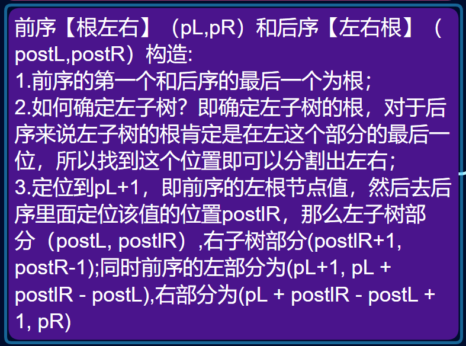
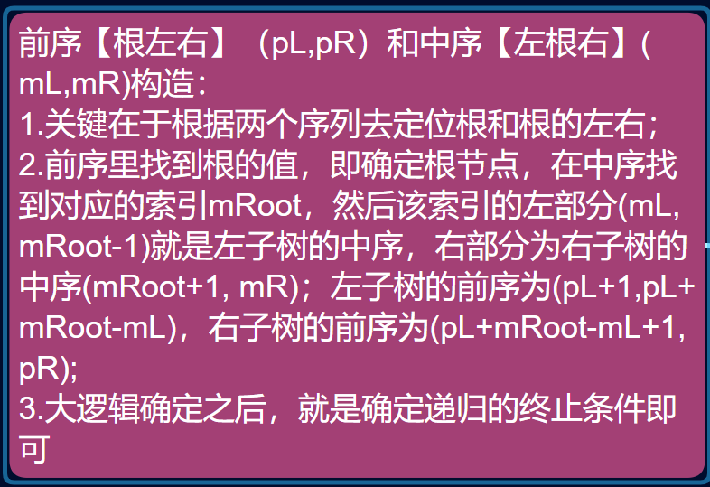

# 解题算法的记录和总结

>本文旨在总结自己平时在刷题时所碰到的数据结构题目以及比较重要和典型的解题思路。
## 主要内容

- [数据结构](#Data_struture)
- [解题思路](#Solve_ideas)

## <a id = 'Data_struture'></a> 1.数据结构篇
### 1.1数组
> 通常是以一维数组或者二维矩阵的形式来
> 考察，典型的类型如下。
- 搜索问题
  > 从给定的数组里面搜索满足条件的值，条件可能是恰好等、第一个大于等于、最后一个小于等_,通常是利用二分的思想去做，二分里面重要的是就是确定两个指针，即哪一个指针指向明确的点，哪一个
  > 指向不明确的，循环直至两指针重合即可；对于有些搜索可能不是二分，但是本质上也是不断缩小搜索的范围
  > 边界，直到边界重合。
  - [在排序数组中查找数字 I](https://leetcode.cn/problems/zai-pai-xu-shu-zu-zhong-cha-zhao-shu-zi-lcof/)
  - [旋转数组的最小数字](https://leetcode.cn/problems/xuan-zhuan-shu-zu-de-zui-xiao-shu-zi-lcof/)
  - 寻找两个正序数组的中位数
  - [二维数组中的查找](https://leetcode.cn/problems/er-wei-shu-zu-zhong-de-cha-zhao-lcof/)
- 排序问题
  > 对于给的数组进行各类排序，或者隐含的利用排序的思想去做。
  - [数组中的逆序对](https://leetcode.cn/problems/shu-zu-zhong-de-ni-xu-dui-lcof/)
  - [计算右侧小于当前元素的个数](https://leetcode.cn/problems/count-of-smaller-numbers-after-self/)
    - >利用的是归并排序在并的时候，判断两个子数组各个值的本质上为判断逆序对。
  - [数组中的第K个最大元素](https://leetcode.cn/problems/kth-largest-element-in-an-array/)
    - >既可以利用堆排序的思想，用一个大小为K的堆保持数组里面最大的K个数，这样总的时间复杂度为nlogK；另一种思路
      利用快速排序的思想，快速排序每一次选定一个基准，然后将基准左边全变成比它小的，右边变成比它大的，我们可以再每一次
      排完之后增加一个判断，如果基准所在的位置为倒数第K个，那么就是我们要求的值，如果在右边，那么就从左子区间继续查找，
      否则从右子区间查找。
      ```python3
      class Solution:
             def findKthLargest(self, nums: List[int], k: int) -> int:
        
                def qucik_sort(left, right):
            
                    pviot = nums[left]
                    l = left
                    r = right
                    while l < r:
                    #先从右往左找第一个不符合大于等于的元素，即小于它的数
                    #如果先从左往右，就需要改变写法，因为先左到右，会导致l一开始的指向变了，指向的是
                    #第一个大于的值，假如是5，6，那么此时l指向6跳出循环，因为此时l并不是指向最后一个小于等于基准的值，所以最后交换基准值的时候就会导致出错，将5和6交换出错，所以这样写的话就需要改成另一种形式。
                        while l < r and nums[r] >= pviot:
                            r -= 1
                        while l < r and nums[l] <= pviot:
                            l += 1
                    #l可能等于r：因为l永远指向的是小于等于基准的值，所以这时候重合意味着l和r指向的数为最后一个小于等于基准的值，l仍然是我们最后要交换的地方；l小于r：l的值和r的值交换之后，l的值仍然是小于等于基准的值，意义不变
                        nums[r], nums[l] = nums[l], nums[r]
                    nums[l], nums[left] = nums[left], nums[l]
                    if l == len(nums) - k:
                        return nums[l]
                    if l > len(nums) - k: return qucik_sort(left, l-1)
                    else: return qucik_sort(l + 1, right)
                return qucik_sort(0, len(nums) - 1)
      
       def quick_search(left, right):
            '''
            以数组的left位置为基准，找该基准应该处于排序的第几大位置，第1大即最后一个位置，也就是数组的末尾
            从左到右先遍历的情况，此时r为最后一个小于基准的位置，和上面的有区别
            '''
            pivot = nums[left]
            l, r = left + 1, right
            while l <= r:#注意，如果仅仅有俩个数[3,4]，这时候如果是l < r就会出错，因为l是默认从left+1开始判断，会默认交换3和4，但实际4>3不应该交换
                #从左往右找第一个大于基准的位置
                while l <= r and nums[l] <= pivot:
                    l += 1
                #从右往左找第一个小于基准的位置
                while l <= r and nums[r] >= pivot:
                    r -= 1
                if l >= r:#说明此时r落在了最后一个小于基准的位置，这里的等号是防止l=r，比如[3,2]，这时候l=1，r=1，如果不break就会无限循环
                    break
                #交换左大右小的
                nums[l], nums[r] = nums[r], nums[l]
            #r所落的位置即不大于基准的最后一个元素上，r的右边全是大于基准的数
            nums[r], nums[left] = nums[left], nums[r]
            return r #返回基准所在的位置
      ```
  - [把数组排成最小的数](https://leetcode.cn/problems/ba-shu-zu-pai-cheng-zui-xiao-de-shu-lcof/)
    - > 巧妙的利用到了快速排序的思想，在原始的快速排序里面，l定位大于基准的位置，r定位小于基准的位置，然后不断交换，
      定位的准则仅是根据值的大小，而这一题里面定位的准则变了一下，变成了 l + pivot < r + pivot，本质上，还是快速
      排序的思想。
  - [对单链表进行快速排序？]()
- 子数组、子序列问题
  > 一般是求给的数组里面满足某一条件的子数组或者子序列的个数，常常需要结合dp去做，即需要用额外的空间来记录之前的
  > 状态，有时候用来记录状态的结构可以是数组，也可以是哈希表（常在前缀后缀里用到），同时状态的定义不一定就直接是题目
  > 所要求解的目标，巧妙设计可以使得算法的效率更高。
  - [连续子数组](#ContinuousSubA)
  - [子序列](#SubSeq)

### 1.2链表
> 链表是一种插入和删除元素比较高效的数据结构，链表的类型可以分为很多类，刷题里面常见的几种有：环形链表、回文链表，相交链表、
> 双向链表等，不同链表会涉及到不同的判断技巧。
- 翻转链表
  - > 只需要每一次翻转当前结点，记录下一结点，然后依次后移即可，一般需要创建一个哨兵结点让第一个结点指向它。
  - [反转链表](https://leetcode.cn/problems/fan-zhuan-lian-biao-lcof/)
  - [k个一组翻转链表](https://leetcode.cn/problems/reverse-nodes-in-k-group/)
- 合并链表
  - [合并k个升序链表](https://leetcode.cn/problems/merge-k-sorted-lists/)
- 环形链表
  - > 对于一个环形链表，最典型的做法就是设置快慢指针，如果在两个指针都不指向None的情况下慢指针再一次和快指针重合，说明链表
    中存在环。
  - [环形链表](https://leetcode.cn/problems/linked-list-cycle/)
- 相交链表
  - > 判断两个链表是否有相交的部分，可以利用跳转的思想，当两个指向两链表的指针指向链表的末尾的时候，让指针跳转到另一个链表上，
    因为两个链表的长度和是一个定值，如果相交的话，那么一定会在这个过程中出现两指针指向的结点是同一个，否则两指针最后都会同时
    到达链表末尾。
  - [相交链表](https://leetcode.cn/problems/intersection-of-two-linked-lists/)
- 回文链表
  - > 回文链表的关键是定位链表的中心，我们可以利用快慢指针去做，也可以统计出链表长度再指针右移去做，定位好之后，就是判断两边
    > 是否对称即可，可以用列表存储元素然后逐个判断即可，也可以先将某一部分反转，然后迭代挨个位置判断即可。
  - [回文链表](https://leetcode.cn/problems/palindrome-linked-list/)
- 双向链表
  - > 每一个结点有指向左右两边的指针，由于双向链表的删除和插入比较高效，但是索引比较低效，所以常常和哈希表结合在一起来实现一个更
    高效的数据结构
  - [LRU缓存](https://leetcode.cn/problems/lru-cache/)
    
### 1.3字符串
> 字符串也是一种经常考察的结构，通常考察的点是匹配问题、子串子序列问题。
- 子串的包含问题
  > 对于判断某一条件的子串是否被包含在给定的字符串里面，一般可以通过数组或者哈希表去统计字符串里面出现的各个字符出现的频数信息，
  > 结合滑动窗口的思想去判断即可。
  - [不含重复字符的最长子字符串](https://leetcode.cn/problems/wtcaE1/)
  - [含有所有字符的最短字符串](https://leetcode.cn/problems/M1oyTv/)
  - [字符串中的变位词](https://leetcode.cn/problems/MPnaiL/)
- 子串的统计问题，常常需要dp
  > 对于可以由之前的状态转移而来的问题，通常可以用dp的思想去做，典型的比如回文问题，字符串匹配问题等
  - [回文子字符串的个数](https://leetcode.cn/problems/a7VOhD/)
  - [实现strStr()](https://leetcode.cn/problems/implement-strstr/)
  - [正则表达式匹配](https://leetcode.cn/problems/regular-expression-matching/)

### 1.4哈希表
### 1.5二叉树
> 二叉树是树结构里面比较特殊的一种，也是算法考察的高频部分。

- 遍历方式
  - [二叉树的前序遍历](https://leetcode.cn/problems/binary-tree-preorder-traversal/)
  - [二叉树的中序遍历](https://leetcode.cn/problems/binary-tree-inorder-traversal/)
  - [二叉树的后序遍历](https://leetcode.cn/problems/binary-tree-postorder-traversal/)
    - >三种遍历方式均有递归和迭代两种方式，时间复杂度都是一样但是递归比迭代的空间复杂度要高，最好使用迭代的
      思路去做，至于迭代过程中结点在迭代过程中存储和打印的2位置就看遍历的方式了，对于前序是根优先，然后是
      左右，所以可以用栈去存储，先打印根+左子树，再打印根+右子树，即把右子树放在栈底部，啥时候放呢，每一次
      从栈中取出根结点的时候依次放入右和左；而对于中序遍历，是左根右，所以我们需要先打印左子树再打印右子树，
      啥时候打印根呢，当然就是沿着当前结点向左深度遍历到结点无左的时候，可以直接将当前结点打印，然后转移到
      右子树里面；
  - [二叉树的层序遍历](https://leetcode.cn/problems/binary-tree-level-order-traversal/)
- 构建方式
  - [根据前序和后序遍历构造二叉树](https://leetcode.cn/problems/construct-binary-tree-from-preorder-and-postorder-traversal/)
    
  - [通过前序遍历和中序遍历构建二叉树](https://www.notion.so/DFS-99fa813923a8476398efc59f406b8d9d#0d8bd2c663054fa7a6205c1f64f5079e)
    
  - [从中序与后序遍历序列构造二叉树](https://leetcode.cn/problems/construct-binary-tree-from-inorder-and-postorder-traversal/)
    
- 常见的二叉树的类型
  - [对称二叉树](https://leetcode.cn/problems/symmetric-tree/)
  - [平衡二叉树](https://leetcode.cn/problems/balanced-binary-tree/)
  - [翻转二叉树](https://leetcode.cn/problems/invert-binary-tree/)
  - [完全二叉树](https://leetcode.cn/problems/count-complete-tree-nodes/)
  - 二叉搜索树
    - [二叉搜索树的后序遍历序列](https://leetcode.cn/problems/er-cha-sou-suo-shu-de-hou-xu-bian-li-xu-lie-lcof/)
    - [二叉搜索树的最近公共祖先](https://leetcode.cn/problems/er-cha-sou-suo-shu-de-zui-jin-gong-gong-zu-xian-lcof/)
    - [进阶版： 二叉树的最近公共祖先](https://leetcode.cn/problems/er-cha-shu-de-zui-jin-gong-gong-zu-xian-lcof/)
    - [二叉搜索树的第k大节点](https://leetcode.cn/problems/er-cha-sou-suo-shu-de-di-kda-jie-dian-lcof/)
    - [前序遍历构造二叉搜索树](https://leetcode.cn/problems/construct-binary-search-tree-from-preorder-traversal/)
    - 

### 1.6图
> 图可以分为有向无向以及有环无环几种情况，其中树就属于一种有根的有向无环图，对于图的问题，关键就是将顶点和边的信息记录下来，
然后根据顶点和边来去对所要求解的问题进行拆解。

- 表示方法
    > 图可以用邻接矩阵和邻接表表示，两者的差别就是邻接矩阵的大小是N * N即关于顶点的平方线性相关，和边数量无关系，而邻接表的
存储空间和边的数量相关，对于无向和有向，可以用出度和入度来表示即可。
- 最小生成树问题
    > 我们知道树是一种特殊的结构，树必须满足有向无环，因为树都有一个根结点，并且任意一个结点只能有一个父结点，但是一个结点可以
有多个子结点，所有满足树必须满足无环、无多父结点，这就导致了N个结点的树一定有N-1条边。  
    > 而最小生成树就是将一个无向有权图转换成一个树（有向无环，这里的有向是因为存在根结点的情况）的过程，所谓的最小就是指的是这个
树所有边的权值和最小，所以该类问题一定是针对于带权的图来说的。
    - Prime算法（按顶点考虑）
    > 首先随机选择一个点加入到生成树里面，并用一个数组记录其它所有点加入到生成树的代价，然后开始迭代：每一次从非生成树的点里面去找
离生成树最小代价的点，然后选择其作为新点加入到生成树里面，同时更新其它点到生成树的代价（因为引入了新点）。【迭代直至所有点加入到生成树】                                                                                                                                                                                                                                                      
    - Kruskal算法（按边考虑）
    > 统计出图里面所有的边信息，然后按照边的大小进行排序，然后开始迭代：每一次选出当前最小的边和其对应的两个顶点，然后判断两个点是否在
生成树里面（用并查集的思想去判断），如果不在，加入到生成树里面，否则直接跳过。
- 最短路径问题
    > 所谓的最短路径问题是经常考察的点，从最简单的单源到单目标点的最短路径、单源到其它所有点的路径问题、各顶点间的最短路径问题。
    - 单源最短路径问题（BFS、Dijkstra）
    > 对于无权图或者所有边的权值都相等，典型的如最短步数问题，因为从一个点到另一个点的代价总是1，这种问题直接每一次BFS，更新代价同时将所有的邻接点
赋予相应的步数即可，每一个点只需要访问一次即可，因为这时候不存在a-b-c比a-c更少代价的情况发生；但是对于有权图来说，就不能简单的访问一次了，
需要每一次BFS的时候选出最短的一个，需要用两个额外的数组来记录源点到各个点的最短距离以及源点到其它各个点的先驱点（-1代表直接到达），这个最短的可以直接截止了，但是其它的点还需要求，
在得到最短的点之后，同时更新源点到其它的还未求得的点的距离（存在a-b-c比a-c更小代价的可能，存在的话直接更新先驱和最短距离），如此迭代下去，时间
复杂度N方，N为顶点个数（Dijkstra算法，但是不适用于有负权值的情况，因为a-b 比 a-c大，但是可能a-b-c 比 a-c小）。
     - 各顶点间的距离
     > 思想和Dijkstra类似，因为这里是统计各个顶点之间的最短距离，所以就需要用到二维数组了，一个二维数组来表示u到v的最短距离，另一个二维数组来表示u到v的前驱点，
由于有N方这么多可能的边，所以每一次需要对这么边进行更新，同时外面的大循环是遍历每一个中转站，即u-k-v里面的k,即总的时间N^3。
### 1.7堆
> 堆是一种带有优先级的树形结构，堆的顶端代表了最小或者最大值的情况，堆的实现通常用数组来实现即可。堆的关键在于堆的构建，而构建堆时需要用到的就是下沉和上浮操作，
上浮即与父结点比较，下沉则与子结点比较，在构建的时候，如果用下沉的话，直接从最后一个非叶子结点进行下沉，然后逐个往前执行下沉操作即可，如果时上浮那么就需要最后一个
结点上浮，两者用的场景也有点不同，在插入新元素到堆的末尾时，通过上浮，因为没有子结点；而新元素在堆顶时就通过下沉更新即可。  
下面是上浮和下沉的简单实现：
``` python
  heapArray = [0 for i in range(N + 1)]

def shiftUp(cur, N):
    '''
     从堆cur结点开始往上进行上浮,保证单个结点的有序就可，默认其它不用考虑
    :param cur:
    :param N:
    :return:
    '''

    fatherN = cur // 2
    if fatherN == 0 or heapArray[fatherN] >= heapArray[cur]:
        return
    else:
        heapArray[fatherN], heapArray[cur] = heapArray[cur], heapArray[fatherN]
        shiftUp(fatherN, N)
def shiftDown(cur, N):
    '''
    从cur结点开始往下下沉
    :param cur:
    :param N:
    :return:
    '''
    if cur > N:
        return
    left, right = cur << 1, cur << 1 + 1
    exchange = None
    pivot = heapArray[cur]
    if left < N and heapArray[left] > pivot:
        exchange = left
        pivot = heapArray[left]
    if right < N and heapArray[right] > pivot:
        exchange = right
    if not exchange:
        heapArray[exchange], heapArray[cur] = heapArray[cur], heapArray[exchange]
        shiftUp(exchange, N)
```
### 1.8并查集
> 并查集是一种表示不同集合之间关系的结构，在实际的问题里面常常需要考虑不同结点的联系，并根据条件去更新关系，满足某些条件的点将会被归属到一类
即一个集合里面，即并；查询各个点所属的集合，即查；通常用结点的父结点来去表示每一个结点所属的集合，这时候有几种表示的思路：1.用结点最近的父表示
其所属的集合，查询的时候很快，但是这样在合并的时候，需要遍历所有的点（将所有和待合并的点属于同一个集合的点进行合并，即更新），时间复杂度就是N了；2.用结点最顶
端的父结点表示所属的集合，这样查询的时候比较慢（需要递归到父才会停止，所以通常用边递归边更新的方式，下一次查就很快），但是合并时很快，只需要将待合并的去更新
即可，总的时间为结点构成的高度h，即递归的时间。
```python
class UnionFind:

    def __init__(self, size) -> None:
        self.size_dict = [1 for i in range(size)]#结点的高度
        self.father_dict = [i for i in range(size)]
    #查找
    def find(self, x):
        #到达顶结点否
        if x == self.father_dict[x]:
            return x
        #递归调用
        ans = self.find(self.father_dict[x])
        self.father_dict[x] = ans
        return ans
    #合并
    def union(self, x, y):
        x_father = self.find(x)
        y_father = self.find(y)
        if x_father != y_father:
            #按照size去合并
            if self.size_dict[x_father] > self.size_dict[y_father]:
                self.father_dict[y_father] = x_father
            elif self.size_dict[x_father] < self.size_dict[y_father]:
                self.father_dict[x_father] = y_father
            else:
                self.father_dict[y_father] = x_father
                self.size_dict[x_father] += 1#+1表示两个相同高度的进行合并，肯定使得最后新的集合高度+1
    def isConnected(self, x, y):
        return self.find(x) == self.find(y)
```

### 1.9线段树
> 线段树是用树来对区间问题进行快速查找和更新的一种结构，适用于那些区间解可以由子区间的解合并得到的问题，比如区间1到区间10的
最大值可以由区间1到区间5的最大值和区间6到区间10的最大值得到这种，并且用树的叶子结点来去保存各个点的值，即每一个位置的值。
线段树的核心就是：构建过程、查询过程、更新过程，现在简单介绍一下这几个过程。
- 构建
     > 从树的根结点（代表了整个区间的信息）开始，往下构建左右子树，左子树代表左半区间的信息，右半区间右半区间的信息，递归进行构建，当碰到的
区间为单独的点的时候，即递归的终止，并且当前结点的信息需要将左右构建完之后才能建立。
- 查询
     > 查询某个区间的时候，无非就存在几种情况，当前待查询区间和当前结点的区间无重合部分（直接返回None）、当前待查询区间包含了当前结点的区间（直接
返回该结点保存的值）、当前待查询的区间被包含当前结点的区间（往结点的左右子结点去查找，左右子的区间会变小，同时将找到的返回并进行比较）。
- 更新
     > 更新无非是更新单个结点的值，找到结点对应树的位置比较容易，通过区间然后二分查找即可；找到之后对叶子结点的值进行更改，更改完之后还需要对沿途上
的区间进行更改，所以区间更改是在子结点更改完之后才进行的。
```python
class Node:
    def __init__(self, l, r, val):
        '''
        :param l: 区间的左端点
        :param r: 区间的右端点
        :param val: 区间的值
        '''
        self.l = l
        self.r = r
        self.val = val
    def __str__(self):
        if self.l != self.r:
            return f'当前结点的区间为[{self.l}, {self.r}], 值:{self.val}'
        else:
            return f'当前结点为叶子结点{self.l}, 值:{self.val}'

def func(x, y):
    if not x and not y: return None
    if not x: return y
    if not y: return x
    return max(x, y)
class SegmentTree:

    def __init__(self, nums_array):
        self.tree = [None for i in range(2 * len(nums_array) + 2)]
        #self.val_hash = {val: i for i, val in enumerate(nums_array)}
        self.leaf_val = nums_array[:]
        self.func = func#自定义的函数，这里定义为求各个区间的最大值问题
    def build(self, cur, l, r):
        '''
        构建区间lr的线段树，
        :param cur: 区间所在的树的索引,构建一般都是从0开始构建
        :param l:
        :param r:
        :return:
        '''
        if l == r:
            self.tree[cur] = Node(l, r, self.leaf_val[l])

            return

        m = (l + r) // 2
        #构建左右子树
        self.build((cur << 1) + 1, l, m)
        self.build((cur << 1) + 2, m + 1, r)
        #根据左右子树结点代表的区间的值更新当前大区间的值
        self.tree[cur] = Node(l, r, self.func(self.tree[(cur << 1) + 1].val, self.tree[(cur << 1) + 2].val))
    def query(self, cur, ql, qr):
        '''
        :param cur: 树的结点索引，一般都是为0代表从根结点开始查询
        :param ql: 待查询的左
        :param qr: 待查询的右
        :return:
        '''
        #当前树结点
        cur_node = self.tree[cur]
        #如果当前树结点的区间和待查询的不相交，说明查询无效
        if ql > cur_node.r or qr < cur_node.l:
            return None
        # 如果当前树结点的区间在待查询的里面，直接返回区间的值
        if cur_node.l >= ql and cur_node.r <= qr:
            return cur_node.val
        lQuery = self.query((cur << 1) + 1, ql, qr)
        rQuery = self.query((cur << 1) + 2, ql, qr)
        return self.func(lQuery, rQuery)
    def updatePoint(self, cur, node_id, updata_val):
        curN = self.tree[cur]
        if curN.l == curN.r:#如果是叶子结点判断值是否相同
            if  curN.l == node_id:
                curN.val += updata_val
                self.leaf_val[node_id] += updata_val
                return
        mid = (curN.l + curN.r) // 2
        if mid >= node_id:
            self.updatePoint((cur << 1) + 1, node_id, updata_val)
        else:
            self.updatePoint((cur << 1) + 2, node_id, updata_val)
        #更新区间的值
        curN.val = func(self.tree[(cur << 1) + 1].val, self.tree[(cur << 1) + 2].val)
    def __str__(self):
        queue = [0]
        while queue:
            for i in range(len(queue)):
                cur = queue.pop(0)
                #print(cur)
                print(self.tree[cur])
                #判断当前是否为叶子，是的话说明没有叶子了，不需要加进去
                if self.tree[cur].l != self.tree[cur].r:
                    queue.append((cur << 1) + 1)
                    queue.append((cur << 1) + 2)
```
### 1.10字典树
> 字典树，也称为前缀树，主要用来查询作用的，即可以看作是一个字典，保存的是单词的前缀信息，即各个位置的信息，比如word插入到字典树里面，
就是'w'→'o'→'r'→'d'，用python实现其实就很容易，其实就是dict，当然也可用数组去存储，将字符转换成对应的位置即可。
### 1.11单调栈
> 单调栈属于一种单调递增的栈，即栈里面存储的值是单调的，在解题用的比较多，典型的就是接雨水的问题。
### 1.12有限状态机
> 用观测状态、隐状态的思想，去把每一个可能的状态以及该状态下的转移方向建模出来，然后按照给的序列依次转移即可。
## <a id = 'Solve_ideas'></a> 2.解题思路篇

### 2.1双指针
### 2.2回溯
### 2.3分治
### 2.4DFS和BFS
### 2.5贪心
### 2.6动态规划
> 动态规划的核心在于**通过之前的状态来得到当前的状态，关键在于状态的定义以及状态转移方程的设计**
> ，不同于贪心里面局部最优可以过渡到全局最优，动态规划需要对于每一种状态都记录，有的是利用前
> 一个状态，有的是利用前面所有时刻的状态，即根据场景的不同而转移的方式不同。
#### 1.连续子数组问题<a id = 'ContinuousSubA'></a>
>对于连续子数组的问题，属于应用DP解题的典例，核心在于原问题等效于求所有子数组的和或者乘积等的最大
> 或最小问题，而所有子数组的可能情况☞求以每一个位置结尾的所有子数组的可能情况☞以当前位置结尾的子
> 数组情况又和**以前面一个位置**结尾的子数组有关☞构成了转移的方向，而转移的状态即当前位置结尾对应的子数组
> 目标值【根据题目不同目标会不一样】

- [连续子数组最大和](https://leetcode.cn/problems/lian-xu-zi-shu-zu-de-zui-da-he-lcof/)
- [乘积最大子数组](https://leetcode.cn/problems/maximum-product-subarray/)
- [环形子数组的最大和](https://leetcode.cn/problems/maximum-sum-circular-subarray/)
- [子数组是否存在满足某个条件的](https://leetcode.cn/problems/continuous-subarray-sum/)
- [元素和为目标值的子矩阵数量](https://leetcode.cn/problems/number-of-submatrices-that-sum-to-target/)
- [统计全为1的正方形子矩阵](https://leetcode.cn/problems/count-square-submatrices-with-all-ones/)
- [最大正方形](https://leetcode.cn/problems/maximal-square/)

#### 2.子序列问题<a id = 'SubSeq'></a> 
>对于子序列问题，相比于子数组少了一个连续的约束条件，因此当前状态可以由更多可能的状态转移而来，即可以不连续的
> 取，所以一般子序列的问题都是求满足某一个条件下的最优子序列求解问题，解决这类问题常规的思路和连续子数组的解
> 题思路一致，唯一的不同就是需要遍历当前位置之前的所有状态的值，即不管是时间还是空间上都是开销比较大的，因此
> 这种情况我们常常结合贪心的思路来去做，这样可以大大减少时间和空间开销。
- [最长递增子序列](https://leetcode.cn/problems/longest-increasing-subsequence/)
- [最长递增子序列个数](https://leetcode.cn/problems/number-of-longest-increasing-subsequence/)
- [俄罗斯套娃信封问题](https://leetcode.cn/problems/russian-doll-envelopes/)
- [堆箱子](https://leetcode.cn/problems/pile-box-lcci/)
- [无矛盾的最佳球队](https://leetcode.cn/problems/best-team-with-no-conflicts/)
#### 3.字符串问题
> 字符串相关考察的问题主要是回文相关问题，比如典型的回文子序列和回文子串问题。

- [最长回文子串](https://leetcode.cn/problems/longest-palindromic-substring/)
- [最长回文子序列](https://leetcode.cn/problems/longest-palindromic-subsequence/)
- [统计不同回文子序列](https://leetcode.cn/problems/count-different-palindromic-subsequences/)
- [段式回文](https://leetcode.cn/problems/longest-chunked-palindrome-decomposition/)
- [让字符串成为回文串的最少插入次数](https://leetcode.cn/problems/minimum-insertion-steps-to-make-a-string-palindrome/)

#### 4.背包问题
>所谓的背包问题，即在给定的背包限制容量下(通常是某一个约束，比如总重量、总体积等)，
> 去从给定的物品里面选取最优的组合值，用dp解答的思路即是逐渐扩大限制条件，逐渐扩大
> 可拿取物体的范围，最后得到全局下的最优解。
- 01问题
  - [分割等和子集:01](https://leetcode.cn/problems/partition-equal-subset-sum/)
  - [一和零](https://leetcode.cn/problems/ones-and-zeroes/)
  - [最后一块石头的重量](https://leetcode.cn/problems/last-stone-weight-ii/)
  - [盈利计划](https://leetcode.cn/problems/profitable-schemes/)
- 完全问题
  - [零钱兑换](https://leetcode.cn/problems/coin-change/)
  - [零钱兑换II](https://leetcode.cn/problems/coin-change-2/)
  
#### 5.状态压缩问题
> 对于题目中给的状态有时候不好表示或者表示起来十分复杂的时候，可以考虑用状态压缩的方式来表示，
> 所谓的状态压缩即将不同的状态用一串二进制数来进行表示，每一个位上的二进制数即代表状态的具体
> 构成，为什么表示成二进制数呢？因为在更新状态和判断的时候我们可以利用二进制中的位运算来巧妙
> 的表示，典型的就是合并状态用或操作，判断用与操作等

- [安卓手势解锁](https://leetcode.cn/problems/android-unlock-patterns/)
- [我能赢吗](https://leetcode.cn/problems/can-i-win/)
- [Nim游戏II](https://leetcode.cn/problems/game-of-nim/)
#### 6.数位dp问题
> 数位dp问题即在求解关于数的不同位值所构成的整体状态的统计问题，典型的比如给定一个数值大小的约束，
> 并给定能取的数字范围，求限制下所能构成的有效数字的个数。

**数位问题的关键在于：**  
1. 根据所给的限制对每一位上的范围做一个计算；  
2. 分析影响当前位置上数字取值的范围的因素【前导0、前值是否达到上界等】；
3. 设计dfs函数，可以用dfs的原因在于高位的状态会影响下低位的值选取情况，
所以从最高位层层往下遍历最后就可以得到想要的结果，因此传入dfs的参数一定
是对当前位值选取范围有决定意义的参数量【位次、前导0、前值是否上界等】，通 
过这些参数来决定当前位的取值范围，然后又根据当前位的选取给下低位传递新的
参数【即递归的思想】，直到碰到递归的终止条件【一般是递归完最低位就可以结束】；
- [最大位N的数字组合](https://leetcode.cn/problems/numbers-at-most-n-given-digit-set/)
- [中心对称数](https://leetcode.cn/problems/strobogrammatic-number-iii/)
- [统计各位数字都不同的数字个数](https://leetcode.cn/problems/count-numbers-with-unique-digits/)
#### 7.概率dp问题
> 运用概率论的知识对问题进行分析来设定状态以及状态转移方程。
- [锦标赛](https://www.notion.so/b3637c19e8f34c8bb32ecce5b5bd10c5#4f251640025944d0ad24dedebd412608)
#### 8.博弈dp问题

## <a id = 'CalucatingProgress'></a> 3.常考的计算过程和典型的算法

- 计算质因子
    > 质数（素数Prime）即除了1和它本身没有其它因子的数，典型的是2，3，5，等，如何快速的求一个数所有的质因子，可以
对一个数从2开始除，如果除的开，就一直除，直到除不开就用下一个数去除，比如3，到了4的时候比不可能除开，因为4是2的倍数，
所以按照这个逻辑，能除开的全是原数的质因子。
    ```python
    import collections
    def getPrimefactors(num):
        '''
        获取数num的质因子分解结果
        :param num:
        :return:
        '''
        #负数或为1
        if num <= 1:
            return False
        primefactorsMap = collections.OrderedDict()
        for denominator in range(2, int(num ** 0.5) + 3):
            while num % denominator == 0:
                primefactorsMap[denominator] = 1 + primefactorsMap.get(denominator, 0)
                num = num // denominator
        #对于很大的本身就是质数的，那么就会出现上面没有保存的情况
        if num > 2:
            primefactorsMap[num] = 1 + primefactorsMap.get(num, 0)
        printAns = [f'{prime}^{power}'for prime,power in primefactorsMap.items()]
        print('*'.join(printAns))
        return primefactorsMap
    getPrimefactors(27)
    ```
- 求两个数的最大公因数，即最大公约数
    > 要求两个数的最大公因数，首先求出两个数的质因子分解结果，然后再找出公共的质因子，指数取较小的即可。
    ```python
    def getMaxCommonfactor(num1, num2):
        if num1 == 1 or num2 == 1:
            return num2 if num1 == 1 else num1
        #获取两个数的质因子分解结果
        num1Primesfactors = getPrimefactors(num1)
        num2Primesfactors = getPrimefactors(num2)
        ans = 1
        #找公共部分
        for prime in num1Primesfactors:
            if prime in num2Primesfactors:
                ans *= prime ** min(num1Primesfactors[prime], num2Primesfactors[prime])
        return ans
    ```
    > 同时求最小公倍数还可以用辗转相除法，即将一个数不断的除以另一个数，同时将余数作为新的被除数，直到取余为0返回即可。
    ```python
    def euclideanMaxCommonfactor(num1, num2):
        '''
        利用辗转相除法求最大公约数
        :param num1:
        :param num2:
        :return:
        '''
        if num1 < num2:
            num1, num2 = num2, num1
        return num2 if num1 % num2 == 0 else euclideanMaxCommonfactor(num2, num1 % num2)
    ```
- 求两个数的最小公倍数
     > 直接取两者中的最大的，然后逐个累加相乘即可，这样是一种比较暴力的；要求两个数的最小公倍数，其实会了前面两个的求法，可以很快的求解出来，
即将两个数相乘然后除以最大公因数即可，这种比较高效。
    ```python
    def getMinCommonMultiple(num1, num2, method = 'euclidean'):
        '''
        求两个数的最小公倍数
        :param num1: 
        :param num2: 
        :param method: 'euclidean'代表使用辗转相除法，否则使用质因子分解的方法。
        :return: 
        '''
        if method == 'euclidean':
            maxCommonfactor = euclideanMaxCommonfactor(num1, num2)
        else:
            maxCommonfactor = getMaxCommonfactor(num1, num2)
        ans = num1 * num2 // maxCommonfactor
        return ans
    ```
- 匈牙利算法
    > 所谓的匈牙利算法，是用来记算最佳的匹配对，即匹配问题的。
    ```python
    import math
    '''
    素数伴侣
        定义：和为素数称为素数伴侣
        素数（质数）：除了1和本身没有其它的因子，因此所有的偶数都不是素数[除了2]，即素数伴侣
        一定是奇偶对，不可能是奇奇或者偶偶，那么我们只需找到奇数数组和偶数数组里面能够构成最多的伴侣对即可.
        对于两个数组odds和evens，如何找到最多的匹配对？
            当我们遍历odds时，遍历到的元素为odd，我们会从evens里面去找能够满足的元素elem，如果不满足好办，直接下一个；如果满足的话，
            不能简单的直接就将结果+1，因为该匹配的元素有可能不是最佳的素数伴侣对，我们想要的是尽可能多，如何
            去保证多？那么可以这样去做：
                当碰到匹配的时候，我们先将该匹配的元素elem标记为已经访问；然后继续去看除了这个元素还有没有别的能够满足的，
                如果有满足的，那么
    '''
    def isPrime(num):
        if num == 2:
            return True
        for i in range(2, int(math.sqrt(num) + 1)):
            if num % i == 0:
                return False
        return True
    def match(evens_array, visit_array, match_array, odd):
        '''
        Args:
            evens_array:偶数数组
            visit_array:访问数组
            match_array:存储偶数数组各个位置匹配的奇数，None即没有匹配值与其配对
            odd:待匹配的奇数
        '''
        for index, elem in enumerate(evens_array):
            #标记访问防止后面递归的时候死循环
            if not visit_array[index] and isPrime(elem + odd):
                visit_array[index] = True
                #偶数数组当前位置还未参与配对，或者是已经配对过的元素还有别的位置可以匹配
                if not match_array[index] or match(evens_array, visit_array, match_array, match_array[index]):
                    match_array[index] = odd
                    return True
        return False
                    
    nums = [3,6]
    evens = [i for i in nums if not (i&1)]
    odds = [i for i in nums if (i&1)]
    match_index = [None for i in range(len(evens))]#存储各个偶数对应的奇数，初始None说明该位置暂时没有奇数匹配
    ans = 0
    for i in odds:#遍历奇数数组，目的是将尽可能多的奇数和偶数数组里面的元素匹配到
        visit = [False for i in range(len(evens))]
        if match(evens, visit, match_index, i):
            ans +=1
    print(ans)
    ```
- KMP算法
  > 字符串kmp匹配，关键在于明白next数组的含义，next每一个位置的意义是next[i]代表当用模式字符串p[i]位置和s[j]匹配失败的时候，这时候pattern下一个
  > 指向应该指向哪里，所以next数组的第一个往往是设定一个flag，比如-1，代表pattern整体和j前移动，其它的位置的next数值可以根据前面的递推得到，利用的就是
  > 前后缀的关系。
  ```python
  def buildNext(pattern):
    '''
    :param pattern:
    :return: next 数组，表示模式字符串里面各个位置前面的最大公共真前后缀长度
    '''
    array = [0 for i in range(len(pattern) + 1)]
    i = 0
    array[0] = -1#这个-1是指的第一个字符不匹配时需要执行的操作，-1代表需要将模式字符和待匹配
    #的向前移动一位
    k = -1 #  最大公共真前后缀长度，初始为-1，即模式字符第一个位置的前后缀长度为-1，后面的需要
    #根据前面位置的k值（即前后缀长度）来得到当前位置的前后缀长度。
    while i < len(pattern):
        '''
        1.如果最大前后缀长度为-1，说明此时不存在前后缀长度相等，即此时需要跳到第一个位置也就是0
    当前位置对应的next数组值初始化为0；
        2.或者碰到满足i位置（这个i是滞后的i，即当前需要记录的位置前一个）和
    k所对应的位置(k为滞后的i那个位置对应的前后缀长度，pattern[k]即pattern[0...k-1]
        后一个)相同的情况，那么此时可以直接在前面的记录基础上进行更新当前位置的next位置。
        '''
        if k < 0 or pattern[i] == pattern[k]: 
            k += 1
            i += 1
            array[i] = k
        '''
        碰到pattern[i] == pattern[k]不相等的情况，需要去找pattern[array[k]]所对应位置是否和
    pattern[i]相等，相等的话只需要赋给pattern[i+1] = array[k] + 1即可。
    '''
        else: 
                   k = array[k]
    return array
  def kmp_match(pattern, s):
  
      array_next = buildNext(pattern)
  
      i, j = 0, 0  #初始化模式字符和目标字符的指针位置
      while i < len(s) and j < len(pattern): #
          if j < 0 or s[i] == pattern[j]:
              i += 1
              j += 1
          else:
              j = array_next[j]
      if j == len(needle):
          return i - j
      else:
          return -1
  
  ```
- Manacher算法
  > 马拉车算法，即统计回文子串数量的时候用到的一种算法思想，由暴力计算以每一个字符为中心的最长回文子串长度到利用之前状态信息来更新当前字符的状态信息
提高了计算的效率，核心点在于关键值的设定：当前最长回文子串的右边界rM，当前最长回文子串的中心位置c，利用当前位置和rM之间的相对位置，给当前位置一个起始
的回文半径，而不需要都从1开始自增，优化了时间。
  ```python
  class Solution:
    def countSubstrings(self, s: str) -> int:
        '''
        利用Manacher算法
        '''
        def transform(s: str) -> str:
            ans = ['#']
            for item in s:
                ans.append(item)
                ans.append('#')
            ans.append('#')
            return ''.join(ans)
        ans = 0
        s_t = transform(s)
        l = len(s_t)
        f = [1 for i in range(l)]#记录每一个位置的最大回文路径
        c = 0#初始化回文的中心（第一个为0）
        r_Max = 0#最大回文子串的右边界（第一个为0）
        for i in range(1, l):
            #初始化最大回文的路径
            f[i] = 1 if i > r_Max else min(r_Max - i + 1, f[2*c - i])
            #向两边扩展
            while(i+f[i]<l and i-f[i]>-1 and s_t[i+f[i]] == s_t[i-f[i]]):
                f[i]+=1
            #更新最大的回文中心和右边界
            if(i+f[i]-1>r_Max):
                r_Max = i + f[i] -1
                c = i
            #根据每个位置的回文半径确定每个位置所拥有的子串个数
            #如果是以'#'为中心，则半径必定为奇数，且半径与实际的对应关系为：   [1→0, 3→1, 5→2]
            #如果是以s里面的字符为中心，则半径必定为偶数，对应关系为如下：     [2→1, 4→2, 6→3]
            ans+=f[i]//2
        return ans
  ```
- 快速幂运算
  > 在求某个数的幂运算的时候，如果直接按照幂数的大小按个去乘，势必会导致时间过大，所以可以采用将指数分解，然后改变基数的形式去优化。
  ``` python
  def fastPower(base, power):
      result = 1;
      while power > 0:
          if power & 1:
              result = result * base
          power >>= 1//此处等价于power=power/2
          base = (base * base)
      return result
  ```
