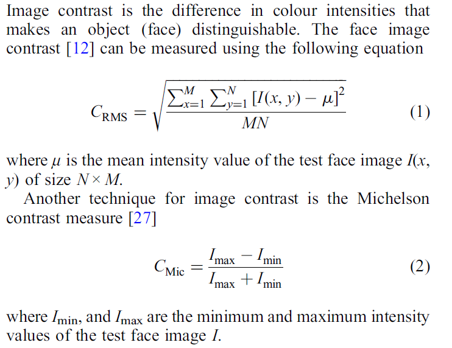

- [1.人脸质量评价](#FIQA)
- [2.美学质量评价]()
- [3.目标检测](#ObjectDetection)
   - [3.1经典方法](#ClassicalMethod)
   - [3.2常见问题](#CommonProblems)
   - [3.3前沿方法](#FrontierPaper)
- [4.人脸识别](#FaceRecognition)
   - [4.1经典方法](#FRClassicalMethod)
   - [4.2常见问题](#ClassicalQuestion)
   - [4.3]()
- [5.语义分割](#SemanticSegmentaiton) 
## 1.人脸图像质量评价
> 何为人脸图像质量？需要明确的一点，人脸图像质量不同于大众的图像质量，人脸图像质量是对图像里面人脸可辨识度的高低而定义的一个
评估指标，即是来度量人脸可用性的。图像里面人脸可辨识度的高低对于人眼来说，比较容易去判断，人眼通过捕捉图像里面人脸的显著性
特征来综合评判人脸代表的是哪个人或者无法判断，这一过程需要经过人的视觉评估系统处理才能得到，大脑在里面起到分析的作用；而现在随着
AI技术的发展，大量自动化的机器识别技术已经在各个场景得到部署应用，人脸识别也不例外，毕竟让人眼去处理大量重复的识别工作在现实
里面是不实际的且低效的，那么对于机器来说，人脸图像同样也会有一个可辨识程度的度量，虽然现在的AI模型已经比较复杂，而且在实际的表现
性能不错，但是相比于人脑来说还是十分简单，而且近些年大量以深度特征为主的深度模型本质上是一种黑盒模型，缺乏一定的可解释性，对于
人脸识别模型来说，即对于机器来说，什么样的人脸是可辨识程度最高的？什么样的人脸对实际的识别工作最可靠？什么样的人脸属于难区分、难
以判别的？这些问题都是值得去思考并探索的，人脸质量评价则旨在从机器消费的角度出发，挖掘人脸图像里面对于识别工作最为重要的信息，从而
实现对人脸图像可用性的准确评判。  
> 实现人脸图像质量评价有什么具体的研究价值？
- 评价分数层面
  1. 人脸图像的预筛选
     > 在人脸识别前端，筛选掉质量过低的人脸质量，避免无效的识别过程发生，提高识别的效率。
  2. 人脸数据库的维护
     > 对于人脸数据库里面的图像，定时更新图像，只保留具有高可用性的人脸图像，使得在人脸验证的时候
  提高召回率和精度。
  3. 人脸图像压缩控制
     > 在内存有一定的限制条件下，对人脸图像进行压缩，压缩的极限可以根据人脸图像质量来控制，使得人脸
  图像的质量在不低于识别阈值的情况下尽可能的低，最大化利用存储空间。
- 特征层面
  1. 辅佐识别模型
     > 利用质量评估模型得到的特征去辅佐识别模型，以提高识别模型的精度。
### 1.1经典的方法

#### 1.人类感知质量指导下的FIQA
> 利用影响图像质量的low-level特征，虽然图像质量和人脸质量不一样，但是还是存在一定的相关性，
毕竟质量很差的人脸图像质量可用性一定也不高。常见的特征有：

- 清晰模糊程度(Blur)：直接会影响人脸图像的聚焦程度，太模糊将无法关注到人脸里面的有效部位。
  > 图像越模糊的话说明低频信息就比较多，高频的信息相对就较少了，而对应梯度上的表现就是图像里面梯度值
比较小，所以图像显得比较模糊，可以通过计算梯度来刻画模糊的程度，比如常用的Sobel算子；也可以用灰度的差异
来刻画，清晰的往往灰度差异更大；熵函数（清晰图像往往比模糊的熵更大，信息更丰富）；二次模糊（对模糊图像的影响
较小）。  
- 光强(Illumination)：指的是投射在固定方向和面积上面的发光强度，发光强度是一个可测量的属性，单位是“每立方米坎德拉”(cd/m2)
  > 即发光强度，当光强过高会导致图像出现过曝光、过低会出现欠曝光，相机的原始数据类型为YUV格式，Y就是亮度
通道，直接加起来算就可以；对于RGB图像转化一下可以得到图像的亮度。
  
- 亮度(Brightness)某些时候用光强来描述：光的主观属性，显示器从暗到亮之间可以调节成不同程度等级的亮度，亮度一般作为感知存在，而不能通过测量来客观评估（但可以说成比例，如50%的亮度）。
  > 亮度是受光强影响的，图像的格式有很多种，有一种是HSB(色调、饱和度、明亮度），我们可以转换得到B分量的值来计算亮度，也有其它的表示
方式。  
- 对比度(Contrast)：图像里面颜色的差异性，使得图像里面的各部分能够得到区分。
  >   可以看出计算对比度方式很多，有的是计算图像强度的最大最小值的差异性，
  有的是计算整体的方差。
- 锐度（Sharpness）：边界过渡的速度，即边界梯度的变化快慢程度，锐度太低会导致边界的信息丢失。
  > 锐度（Sharpness）常用于描述边界处图像信息过渡的快慢。高反差图像过渡速度非常快，可以形成非常明确的边缘，
而低反差图像存在一定的过渡缓冲，表现在成像上就是模糊的边缘，计算的方式和模糊度类似。
  
- 姿态（Pose）
  > 俯仰角pitch（绕x轴-左右方向）、偏航角yaw（绕y轴-上下）、翻滚角roll（绕z轴-前后），通过关键点检测
然后解出旋转向量，最后得到各个角度值。因为对于人脸来说，肯定是姿态正对对识别

> 得到各种特征之后，就是用不同的模型来去进行分类或者回归分数了，典型的有支持向量机、逻辑回归、神经网络、高斯混合模型。
#### 2.基于人脸质量的国际标准
> ISO/IEC 29794-5草案规定了面部图像客观和定量质量分数的计算方法，介绍了人脸对称性、分辨率和大小、光照强度、亮度、对比度、颜色、曝光、清晰度等方面的确定方法。
具体体现在三块，分别是场景要求、摄影要求和数字要求三个方面。

- 脸部的对称性（Symmetry）
   > 脸部是否是关于中线对称的对人脸图像的可用性影响也较为显著，所以通过检测人脸图像的对称性对人脸图像质量评价也很关键，
可以通过对左右两部分分别进行模板处理，然后得到各自的结果进行相似度计算，典型的Gabor滤波方法。
- 眼部距离

> 这些传统的方法里面都需要人工去构造人脸图像质量标签，比如要么人工去对图像质量设定等级，要么是通过计算相似度去得到图像质量分数，图像质量分数的表示过程
可能是各因素的单一质量分数加权和或者图像的整体分数。
#### 3.结合人脸识别系统构建的FIQA
> 传统的方法里面主要还是从感知的层面设计手工的特征来去预测FIQA，而随着大量以深度学习为核心的人脸识别技术涌现，人脸识别系统的
识别效能相比于传统的方法有着显著的提高，所以FIQA的研究也逐渐与人脸识别模型结合在一起，即挖掘人脸图像里面对识别模型影响最大的
可用识别特征，而具体研究的角度可以概括为：研究如何结合人脸识别模型来挖掘人脸图像的关键信息并准确的表示人脸图像的质量。

- FaceQnet v0 & v1
> 该方法是较典型的应用深度学习的FIQA方法，核心在于利用人脸识别模型来生成人脸图像质量标签，所以生成的质量标签好坏与人脸识别模型的精度
紧密联系在一起；用生成的质量标签，结合深度网络模型通过数据驱动的方式来去让网络自己学习由图像到可用性标签的映射，得到一个FIQA深度模型，本质
上是一个暗盒模型，最后发现基于深度学习的方式得到的模型比传统的性能要好，但是这里其实缺乏一定的解释性，因为黑盒模型出来的特征本质上是一个
高层语义特征，难以直接用可视化的效果来展示可解释性。
- SDD-FIQA
> 不同于FaceQnet里面利用probe图像和gallery图像之间特征的相似度作为质量标签，该方法挖掘图像可用性和图像类内、类间分布的关系，通过计算
分布之间的Wasserstein距离来表示人脸质量。
- SER-FIQ
> 质量高的人脸特征对于识别模型来说应该是鲁棒性较强的，即受模型的改变影响较小，对于不同的识别模型都应该是高可用性的，基于此，该方法挖掘人脸图像
特征的鲁棒性和人脸图像质量之间的关系，通过改变网络模型里面的dropout值，相当于生成了多个不同的子模型，然后将待预测的人脸图像传入这些不同的子模
型里面，最后计算模型输出的所有特征之间距离的平均值，用该值的高低来去反应图像质量的高低。
- MagFace
> 前面的几个方法都是在一个已经训练好的人脸识别模型基础上来进行人脸质量的研究，这样做的话使得识别过程和质量评估的联系没那么紧密，并且质量评估紧紧
依赖识别模型的精度，容易造成较大的偏差，而MagFace里面将质量评估融入到人脸识别过程里面，使得两者耦合于一个模型里面，评估指导识别、识别依赖评估，
通过设计一个质量感知型的网络来很好的将质量和识别融合到了一起，让识别模型在进行识别工作的同时对人脸图像有个质量的感知。
## 3.目标检测篇
### 3.1经典方法
- Two-stage
  #### 1.滑动窗口
  >滑动窗口产生候选框→候选框的特征送入到SVM分类器进行分类、线性回归进行回归
  #### 2.R-CNN
  >不再采用滑动窗口，而是用选择性搜索的方式得到候选区域→不同的区域通过resize传入到网络模型里面得到不同区域的
  > 特征→传入到SVM分类器里面进行分类+线性回归回归。
  #### 3.SPP-Net
  >为了解决resize导致的目标出现形变的问题，引入了SPP即调整金字塔池化，并且先提取整张图的特征，然后在特征层面
  > 去选取候选区域→传入到SVM分类器进行分类+线性回归回归。
  #### 4.Fast-R-CNN
  >借鉴了SPP的思想，采用了ROI池化（即理解为单一尺寸的池化），并且在特征层面去提取候选区域的特征→采用全连接层
  > 进行最后的分类和回归，分类采用softmax、回归采用smooth L1 loss。
  #### 5.Faster-R-CNN
  > 不再是提前生成候选区域，而是结合anchor的设计，让网络一部分RPN检验anchor是否是背景还是非背景，然后将
  检验为非背景的部分传入后面的分类回归网络进行最后的目标检测和回归，整体上看已经很接近one-stage的设计思路
  > 了，即尽可能将候选框提出和检测流程融到一块。
- One-stage
  #### 1.Yolo
  > 将待检测的图片划分成等大的网格，每个网格经过深度网络(后面是两层全连接层+reshape构成)映射到输出feature map的一个点上，该点的不同通道
  > 存储了网格里面是否存在目标的信息，在原论文的设计里面，每一个网格负责预测两个目标（其实实际里面更加简化了，
  > 即这两个目标默认是同一个），所以yolo里面实际的检测框数目很少，即S x S x 2，并且实际的目标只能有S x S个，所以
  > yolo对于那些在同一个网格里面出现多个目标的情况检测很差。
  #### 2.SSD
  > 采用深度网络模型VGG19作为特殊提取backbone部分，不过将全连接层换成了全卷积（全连接会损失空间上的信息），同时对于不同层上的
  > 特征图抽取出来分别来预测各个点上的框（每个点上会设默认的box，预测默认的框之间的偏差即可)。
  #### 3.Yolov2
  > yolo系列里面开始引入anchor的方法，使得能够检测的框的数目大大增加，；网络上采用了darknet19，并且将低层的特征和高层的特征进行
  > 融合，使得最后对小目标的检测效果更好。
  #### 4.Yolov3
  > 网络上采用了darknet53，并且加入了FPN的操作，将高层的特征通过上采样和低层的特征进行融合，使得高层的特征包含的信息更加丰富。
  > 
  #### 5.Yolov4
  > 网络结构采用了CSPDarkNet53+Neck（SPPNet+PAN）+yolov3head；框的回归采用了CIOU； 加入了很多的训练技巧：
     数据增强：Mosaic数据增强，即对四张图像进行随机的缩放、裁剪和排布，多张图像的融合；
     数据不平衡问题：hard负实例挖掘、在线困难实例挖掘，焦点丢失、标签平滑、知识蒸馏；
     正则化：DropPath、DropBlock；
     模拟物体遮挡：随机的选择部分矩形区域、在特征图上dropblock。
  #### 6.Yolov5
  > 网络结构增加了Focus操作，即切片操作； 自适应的锚框的计算，非预先选定，而是在训练过程中同步迭代； 自适应图片的缩放：即测试的时候采用缩减黑
  > 边的方式，而不是传统直接填充，分别求出长宽的缩放比例，并找到最小值；按照最小缩放比例对图像做同性缩放；padding到想要的尺寸。 
  > 其实就是先resize再padding，这样填充黑色比较少。
### 3.2常见问题
#### 1.正负样本的划分方式以及为什么让一个gt对应多个正anchor？
> 1.正样本就是用来学习anchor(先验框)怎么回归的；2.关于正样本的选取，不同的算法设定的策略有所不同，对于yolov3,先判断物体中心点落在哪个网格内，然后计算目标框(gt)与该网格内所有anchor的iou,
取iou最大的那个为正样本；对于faster_rcnn，首先计算每一个anchor与目标框的iou,如果超过正样本阈值则设定为正样本，然后对每一个目标框将最大iou的anchor设置为正样本（此时iou可能小于正样本阈值），
保证每一个目标框最少有一个正样本与其匹配；3.每一个gt框匹配多个正样本，能够使模型学习的更充分，二阶段检测算法比一阶段算法精度更高，在一定程度上就是因为二阶段检测算法能够匹配更多的正样本以及设置更
好的正负样本比例，每个gt框只取对应一个IOU最大的正样本也可以，只是可能会影响模型的精度．
#### 2.对anchor-free和anchor-based的理解？
> 1.anchor-free：就是在检测的时候不依赖手动设计anchor，即让网络自己去学习实际的框大小和形状，不给一个基准，比如yolov1就是典型的anchor-free，其实anchor-free和实例分割里面的思想比较接近了，
> 即预测目标的中心位置以及框的大小（不同于anchor-based是对所有anchor对应的预测框进行回归和分类），因此anchor-free更像是一种像素点单anchor的情况。  
> 2.anchor-based：预先设计出不同的anchor，之后的框的检测和回归都是在这些anchor之上进行预测的，需要有比较多的先验知识在里面。  
- anchor-based的优缺点：
>   - 优点：  
      1.  手工设计了不同的anchor，后面直接网络在这些anchor上面预测，能够保证网络的性能不至于很差。  
      2.  由于设计的anchor大小和形状多变，对于最终的召回效果有提升作用，特别是小目标的检测。
>   - 缺点：  
      1.  生成的anchor需要较强的先验知识，即不同的任务下anchor就可能需要改动。  
      2.  生成的anchor可能存在很多冗余的，即存在大量的负样本，正负样本不平衡的问题，这也是导致one-stage性能不如two-stage的原因之一。  
      3.  正负样本的阈值问题也是一个需要设计的点。
- anchor-free的优缺点：
>    - 优点：  
      1. 不需要很强的先验知识，但是对网络模型的要求更高一点，冗余的框少了很多。
      2. 解空间更加的灵活，并且计算量会更小，使得检测模型更加高效。  
>    - 缺点：  
      1. 语义的模糊性，典型的比如有两个目标落在同一个网格区域里面，那么这样就会导致只能检测出一个出来，而anchor-based可以都检测出来。
      2. 因为缺失一个先验知识作为基准，使得检测结果不稳定，所以需要加入一些trick。
### 3.3前沿思想
- [yolox](https://zhuanlan.zhihu.com/p/392221567)
  > 1、Decoupled head(预测分支解耦):相比于yolov3到v5，其中的分类和回归都是共享一个特征，即非解耦的方式得到，yolox里面采用解耦的方式分别来预测
  > 框的类别和回归坐标。  
  > 2、强大的数据增强:添加Mosaic（将图片进行随机的旋转、裁剪、拼接）和MixUp（两张图以一定的比例对rgb值进行混合，同时需要模型预测出原本两张图中所有的目标）。  
  > 3、Anchor-free：使用anchor时，为了调优模型，需要对数据聚类分析，确定最优锚点，缺乏泛化性；增加了检测头复杂度，增加了每幅图像预测数量。
  > 使用ancho-freer可以减少调整参数数量，减少涉及的使用技巧。  
  > 4、[SiamOTA:](https://zhuanlan.zhihu.com/p/392221567) 其实就是正样本的选择方式，有的是直接将gt所在的那个格子中所有的预测框与gt计算
  > 取最高的作为正样本（yolov3）;有的是取所在网格一定半径的格子来计算得到多个正样本；这里anchor-free下每一个特征图只预测一组anchor，而SiamOta的
  > 核心就在于对于不同的gt，我们去计算出前10个损失最小的框，然后将这些框的IOU求和，求和的结果就是最后要选择的正样本数量，即对于不同gt选不同的正样本数量。
- [yolov6](https://tech.meituan.com/2022/06/23/yolov6-a-fast-and-accurate-target-detection-framework-is-opening-source.html)
  >统一设计了更高效的 Backbone 和 Neck ：受到硬件感知神经网络设计思想的启发，基于 RepVGG style[4] 设计了可重参数化、更高效的骨干网络 EfficientRep Backbone 和 Rep-PAN Neck。
  优化设计了更简洁有效的 Efficient Decoupled Head，在维持精度的同时，进一步降低了一般解耦头带来的额外延时开销。
在训练策略上，我们采用Anchor-free 无锚范式，同时辅以 SimOTA 标签分配策略以及 SIoU 边界框回归损失来进一步提高检测精度。
- [yolov7](https://arxiv.org/abs/2207.02696)
  > 主要在几个方面做了改进：1.模型的结构重参数化，即将原来训练中的参数在推理的时候转化为等效的另一组基本可以等效的参数，减少网络结构的复杂度，本文研究了
  > 如何高效的去替换；2.针对网络的参数提出了扩展和复合缩放，高效利用参数。
## 4.人脸识别篇
> 人脸识别即身份识别，高级语义信息提取的过程，整个人脸识别的流程大致可以分成人脸校正、人脸裁剪、人脸特征提取、人脸比对或者直接人脸识别（本质上也是人脸比对）。
### 4.1经典方法
#### 1.FaceNet
> 采用三元组的形式，即传入p、n、t三张人脸图像，让网络学习的特征表示使得p和t尽可能的近，使得n和t尽可能的远，所以这里采用的是三元损失。
#### 2.VGGFace
> 利用VGGNet来做的人脸识别工作，首先训练人脸分类器，然后对分类也就是最后的映射层进行三元组学习人脸表示。
#### 3.Sphereface（乘性角度）
> 引入了角度度量的思想，即在原始softmax分类损失的基础上加入了角度间隔的约束，使得原来的分类问题变得更难，即不光是要分类正确，还要使得不同的类别的决策边界之间
> 存在一定的角度，这样能够使得人脸特征更具判别性。Sphereface是对原来的角度乘以了一个因子，使得对人脸图像距离人脸中心的角度要求更小，即同一类的人脸特征表示将会
> 更加的紧凑。
#### 3.Cosface（加性余弦）
> 和Sphereface的思想是一致的，只不过是在余弦值的层面去约束，也就是相似度的层面，通过对原始的余弦值进行一个减值操作来使得原来相同角度余弦下的损失更大，即约束
相当于更强了。
#### 4.Arcface（加性角度）
> 在角度上做文章，同样也是使得在原来的角度下相似度会变低，即要么角度变大，要么是直接相似度变低(Cosface的做法)；这里是
> 让角度变大，即加上一个角度的偏移。
###<a id = 'ClassicalQuestion'><a/> 4.2常见问题的思考
#### 1.人脸识别方法的总结
人脸识别问题本质是一个分类问题，即每一个人作为一类进行分类检测，但实际应用过程中会出现很多问题。第一，人脸类别很多，如果要识别一个城镇的所有人，那么分类类别就将近十万以上的类别，另外每一个人之间可获得的标注样本很少，会出现很多长尾数据。根据上述问题，要对传统的CNN分类网络进行修改。

我们知道深度卷积网络虽然作为一种黑盒模型，但是能够通过数据训练的方式去表征图片或者物体的特征。因此人脸识别算法可以通过卷积网络提取出大量的人脸特征向量，然后根据相似度判断与底库比较完成人脸的识别过程，因此算法网络能不能对不同的人脸生成不同的特征，对同一人脸生成相似的特征，将是这类embedding任务的重点，也就是怎么样能够最大化类间距离以及最小化类内距离。

在人脸识别中，主干网络可以利用各种卷积神经网络完成特征提取的工作，例如resnet，inception等等经典的卷积神经网络作为backbone，关键在于最后一层loss function的设计和实现。现在从两个思路分析一下基于深度学习的人脸识别算法中各种损失函数。

思路1：metric learning，包括contrastive loss, triplet loss以及sampling method

思路2：margin based classification，包括softmax with center loss, sphereface, normface, AM-sofrmax(cosface) 和arcface。

- Metric Learning
  - Contrastive loss
    >深度学习中最先应用metric learning思想之一的便是DeepID2了。其中DeepID2最主要的改进是同一个网络同时训练verification和classification（有两个监督信号）。其中在verification loss的特征层中引入了contrastive loss。Contrastive loss不仅考虑了相同类别的距离最小化，也同时考虑了不同类别的距离最大化，通过充分运用训练样本的label
      信息提升人脸识别的准确性。因此，该loss函数本质上使得同一个人的照片在特征空间距离足够近，不同人在特征空间里相距足够远直到超过某个阈值。(听起来和triplet loss有点像)。
      
  - Triplet loss
    >Google在DeepID2的基础上，抛弃了分类层即Classification Loss，将Contrastive Loss改进为Triplet loss，只为了一个目的：学习到更好的feature。
直接贴出Triplet loss的损失函数，其输入的不再是Image Pair，而是三张图片(Triplet)，分别为Anchor Face, Negative Face和Positive Face。Anchor与Positive Face为同一人，与Negative Face为不同的人。那么Triplet loss的损失函数即可表示为：
      
     本质上是使得anchor和postive的图像对映射得到的特征距离尽可能的小，anchor与negative的图像对映射得到的特征距离尽可能的大。
- 存在的不足：
  - 模型训练依赖大量的数据，拟合过程很慢。由于contrastive loss和triplet loss都是基于pair或者triplet的，需要准备大量的正负样本，，训练很长时间都不可能完全遍历所有可能的样本间组合。网上有博客说10000人、500000张左右的亚洲数据集上花一个月才能完成拟合。
  - Sample方式影响模型的训练。比如对于triplet loss来说，在训练过程中要随机的采样anchor face, negative face以及positive face，好的样本采样能够加快训练速度和模型收敛，但是在随机抽取的过程中很难做到非常好。
  - 缺少对hard triplets的挖掘，这也是大多数模型训练的问题。比如说在人脸识别领域中，hard negatives表示相似但不同的人，而hard positive表示同一个人但完全不同的姿态、表情等等。而对hard example进行学习和特殊处理对于提高识别模型的精度至关重要。
- 对此做的改进
  - finetune
    > 不再是直接用三元组来训练人脸识别网络，而是先用softmax训练人脸识别模型，然后再将顶层的分类层去掉，换成triplet层，相当于对特征进行校正，加快了速度。
  - 损失函数做的改进（引进对hard sample的挖掘，使得模型得到更具判别性的特征）
    > 对于batch中的每一张图片a，我们可以挑选一个最难的正样本和一个最难的负样本和a组成一个三元组。首先我们定义和a为相同ID的图片集为A，剩下不同ID的图片图片集为B，则TriHard损失表示为：  
       
    损失函数的另一形式也可表示为：
       
     我们知道，contrastive loss和triplet分别是利用二元组和三元组的信息，并且没有考虑难样本的挖掘，针对此，有一种lifted structure feature embedding的方式被提出：
       
    作者在此基础上给出了一个结构化的损失函数。如下图所示:
       
    通过这种方式，让类间最大距离（难样本）尽可能的小，同时使得类间最小的距离尽可能的大。
       
    上面的损失函数解决了难样本挖掘的问题，但是对于非常难的负样本，通常损失会非常的平滑，也就导致模型不能很好的学习到有效的信息，这时候可以加入自适应的损失，即提高那些比较难的
    负样本对的损失，让模型能够充分挖掘这样难负样本对的有效信息。  
         
     上面的beta即是来判断样本难易程度的阈值，对于同类的样本对，当然是在距离超过某一个值时判定为难，此时损失会增加；同理负样本对也一样。
  - 对sample方式的改进
    > 作者的分析认为，sample应该在样本中进行均匀的采样，因此最佳的采样状态应该是在分散均匀的负样本中，既有hard，又有semi-hard，又有easy的样本,通过计算样本对的距离的分布的概率，
     最后推出每一个距离下采样的比例，从而实现整个数据样本上的均匀采样。
     
- Margin based
  > 所谓的margin based就是在margin也就是特征的角度层面进行改进，迫使类内特征更加紧凑，类间特征更加分散。
  - Center Loss
    > 在softmax的基础上加上样本特征距离类中心的距离:
     
  - L-Softmax
    > 对于类内的样本特征角度乘上一个常数，从而使得类内的样本特征间距更加紧凑，本来夹角是10度的人脸特征对可能
    就已经够了，加入了这样一个常数后，假如是2，那么相同的条件下就会限制样本特征角度为5度。
     
     
    但是这里没有对w进行归一化，即没有考虑到特征的模值带来的影响。
  - Normface
    > 在传统的softmax基础上对样本的特征和参数进行了归一化。
     
  - AM-softmax(CosFace、Sphereface、Arcface)
    > 综合了前面的特征归一化以及大间隔的损失函数特点进行的改进，改进的方向分别为在余弦值上、乘性角度、加性角度上。

#### 2.难样本问题
> 按照学习的难以来区分，我们的训练集可以分为Hard Sample和Easy Sample. 顾名思义，Hard Sample指的就是难学的样本 
（loss大），Easy Sample就是好学的样本（loss小），在人脸图像里面难样本可以理解为那些相似但非同一个人脸id的图像或者
不相似但是是同一个id的图像，通常是由于拍摄的环境影响的，人脸的角度、图像的噪声都会影响人脸特征的判别性，这样会让模型在
训练的时候捕捉到了对判别无关紧要甚至是干扰项的噪声。

## <a id = 'SemanticSegmentation'><a/>5. 语义分割

> 语义分割不同于目标检测，语义分割是一种细粒度更精确的检测，即是像素级别的，而目标检测是对局部区域的检测，是对某一类
的object进行检测，往往有一个目标中心，而语义分割要求对object所在的