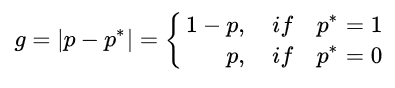
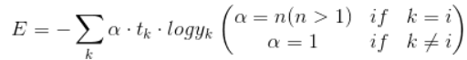

- [1.图像质量评价](#IQA)
   - [1.1经典方法](#IQAclassificalM)
- [2.人脸质量评价](#FIQA)
- [3.美学质量评价](#AQA)
- [4.目标检测](#ObjectDetection)
   - [4.1经典方法](#ClassicalMethod)
   - [4.2常见问题](#CommonProblems)
   - [4.3前沿方法](#FrontierPaper)
- [5.人脸识别](#FaceRecognition)
   - [5.1经典方法](#FRClassicalMethod)
   - [5.2常见问题](#ClassicalQuestion)
   - [5.3]()
- [6.语义分割](#SemanticSegmentaiton) 
   - [6.1经典方法](#SSClassicalMethod)
   - [6.2常见问题](#TypicalQue)
   - [6.3前沿方法](#SOTA_Method)
## <a id='IQA'><a/>1.图像质量评价
> 视觉信息是每一个人生活中接受最多的一种信息，每时每刻几乎都要对各种各样的视觉成像信息做出处理，在如今这样一个大数据
时代，作为多模态信息里面的一种形式，图像也自然成为了各个领域逃不开的研究对象，一幅图像可以提供很多有价值的信息，如何去
挖掘并提取图像的有效信息也就是目前机器视觉主要做的工作，而图像质量作为图像最为核心的部分，对于各个领域都有很大的研究价值，
比如在图像的解压缩、视频的编解码、视频监控等领域，对图像质量做出准确高效的评估需求日益增加并且意义重大。  
> 图像质量评价具体的研究价值？
- 衡量编解码算法以及软硬件实现的优劣。
- 评估图像、视频经过通信传输系统后的失真即质量损失程度，衡量系统的优劣，以助于后续的改进。
- 衡量图像增强、重建算法的优劣。
- 用户终端的视频质量的实时监视。  
> 图像质量评价的分类
- 主观评价方法（S-IQA）
> 主观评估方法主要可分为两种：绝对评价和相对评价。  
绝对评价是由观察者根据自己的知识和理解，按照某些特定评价性能对图像的绝对好坏进行评价。在具体执行过程中通常采用双刺激连续质量分级法 
(Double Stimulus Continuous Scale, DSCQS) 将待评价图像和原始图像按一定规则交替播放持续一定时间给观察者，然后在播放后留出一定的时间
间隔供观察者打分，最后将所有给出的分数取平均作为该序列的评价值。  
相对评估中没有原始图像作为参考，是由观察者对一批待评价图像进行相互比较，从而判断出每个图像的优劣顺序，并给出相应的评价值。在具体执
行过程中通常采用单刺激连续质量评价方法 (Single Stimulus Continuous QualityEvaluation, SSCQE) 将一批待评价图像按照一定的序列播放，此
时观察者在观看图像的同时给出待评图像相应的评价分值。  

   - MOS（Mean Opinion Score）
   > 观察者的平均的质量判断分数，即是一个绝对的分数或者绝对的质量等级。
   - DMOS（Differential Mean Opinion Score）
   > 观察者的平均的质量判断分数偏差（可以理解为离高质量图像的感知偏差），即是一个比较过后的分数。
- 客观评价方法（O-IQA）
   - FR-IQA
   - RR-IQA
   - NR-IQA  
> 图像质量评价的指标  
  

### 1.1经典的方法

#### 1.全参考
- MSE和PSNR  

    > 基于逐个的像素点信息进行比较，概念直观而且容易计算，但是和人的直观感受大相径庭，即与主观感受之间存在割裂。
- SSIM(Structure Similarity Index)  
      
  
    > 基于一个客观事实：人眼的观看习惯总是倾向于先对整个画面进行大致信息提取后再对细节进行进一步的观察；人眼对高频
信息更为敏感，而对于平坦和缓慢变化的区域不会分配过多的注意力。  
     计算图像之间亮度信息、对比度信息以及结构信息的相似度。  
各种不同的形式：
    - MS-SSIM
    - IW-SSIM
    - GSSIM
    - FSSIM  
                                                                                                                       
- VSI(Visual Saliency-Induced Index)
    > 利用图像显著性特征图失真情况来对图像质量进行评估，即使用视觉显著性的MSE失真值来反映图像失真情况。
      
#### 2.半参考
   > 介于无参考和全参考图像，半参考相对来说研究比较少。
#### 3.无参考
   > 所谓的无参考，即在对图像进行质量评估的时候，没有一个无失真源图像的参考信息，仅仅根据输入的待预测图像去得到图像的质量
分数。
- 针对图像特定的类型的失真来评价图像质量（块效应、模糊、振铃效应、噪声、压缩或传输损失）
   - CPBDM（模糊）
   - LPCM（模糊）
   - NJQA（噪声）
   - JPEG-NR（JPEG压缩失真）
- 基于自然场景统计特征（即不对任何失真做出假设，而是设计出合理的特征提取的方式，使得图像质量能够通过统计规律来得到）
  > 基于NSS特征的无参考图像质量评估方法比早期的模型更加通用和一般化。NSS表明经过适当规范化的高质量真实世界摄像图像会
遵行一定的统计规律，基于NSS统计量的特征量更能准确预测图像失真。
  - BRISQUE
         
         
       > 对自然图像，首先进行亮度的归一化处理，亮度会存在一个分布，这个分布本身是符合高斯分布的（即本身会有参数），然后自然图像各个
图像会有各自的经验分布，这些经验分布符合高斯统计特性。当图像出现相应的失真之后，经验分布会出现一些变化，所以可以通过量化经验
分布的拟合参数可以来预测质量分数。首先将图像进行MSCN的归一化计算，用广义高斯分布来拟合MSCN的分布，GGD的形状参数α和分布方差sigma。
接下来对MSCN系数进行二阶分析，在垂直、水平、主对角和次对角方向上进行非对称广义高斯分布的拟合，分别得到表征分布形状的四个参数。这样
在原图像尺度上得到18个特征。图像和视频本质上是多尺度的，失真可以在不同的尺度上表现得不同。因此在降采样2倍的图像上再次提取18维度的特征，
这样BRISQUE的特征集是36维。通过机器学习训练出能够从高维特征映射到低维MOS分数上的回归模型。
  - NIQE
         
         
       > NIQE是首个提出的完全盲模型。首先进行MSCN归一化，然后利用sigma的特定域值选出图像中信息最丰富的patch，在自然无失真图像集中提取
出的patch上进行基于NSS的特征提取，用多元高斯模型MVG拟合出Pristine的模型参数，miu和sigma，即平均值和协方差矩阵。在实际进行质量评估时，只
需要在待测图像上进行同样的特征提取过程和MVG拟合过程，得到distortion的参数niu和sigma。通过计算两组参数的距离，来判断待测图像的失真程度。

- 词袋模型(码本)
  - CORNIA
       > 通过从一组未标记图像中提取的原始图像块聚类来学习字典/码本，并通过应用额外的时间滞后池学习帧级质量分数，进而应用到视频质量评估
  - HOSA
       > 基于码本，采用统计聚类，码本小且性能好。
- 深度学习模型
  - Meta-IQA
       > 利用元学习的思想，让网络学会去学习的能力，即让网络学习如何由一个任务迁移到另一个任务下。这里具体的做法是，首先初始化网络模型
      的参数theta，在一个大的迭代里面，让网络在K个不同的任务上进行双层梯度更新（训练集+查询集），不同任务下会有不同的参数更新方向，一共k个任务就会有k个不同的参数
      更新方向，最后对初始化的参数theta进行更新，更新的方向和幅度由这k个任务下的更新的平均值来决定，可以理解为学习的是一个最佳的初始化参数，
      这个参数最佳的含义是由该参数网络能够很快的在不同的任务上收敛，即学习能力最佳，这也是元学习的思想。  
              
  - CoINVQ from google（CVPR 2021)
       > 
  - CenseoQoE from Tencent
       > 腾讯的图灵实验室提出了一个既能做全参考也能做无参考，既能评估图像，也能评估视频的的网络模型。Backbone 可以选择在Imagenet数据集上进行过预训练的
Mobilenet, Shufflenet, ResNet-18等等。GAP将特征向量展平，再输入到全连接层，输出预测分数。无参考模型的输入是待测失真内容，全参考的输入由两部分组成，
一部分是待预测的失真内容，一部分是reference和distortion的信息差。进行视频评估时，将每帧视频输入到模型中，预测的分数进行平均得到这个视频的分数。损失
函数由两部分组成，LMAE是一个Batch size里所有图像或视频的预测分数与MOS之间的绝对值差的平均。LRANK遍历batch里的任意一对图像或视频的预测分数和MOS差距的差值，
比如，任意两个图像的预测分数之差，和实际MOS分数之差，越接近，表明预测越精准。
## 2.人脸图像质量评价
> 何为人脸图像质量？需要明确的一点，人脸图像质量不同于大众的图像质量，人脸图像质量是对图像里面人脸可辨识度的高低而定义的一个
评估指标，即是来度量人脸可用性的。图像里面人脸可辨识度的高低对于人眼来说，比较容易去判断，人眼通过捕捉图像里面人脸的显著性
特征来综合评判人脸代表的是哪个人或者无法判断，这一过程需要经过人的视觉评估系统处理才能得到，大脑在里面起到分析的作用；而现在随着
AI技术的发展，大量自动化的机器识别技术已经在各个场景得到部署应用，人脸识别也不例外，毕竟让人眼去处理大量重复的识别工作在现实
里面是不实际的且低效的，那么对于机器来说，人脸图像同样也会有一个可辨识程度的度量，虽然现在的AI模型已经比较复杂，而且在实际的表现
性能不错，但是相比于人脑来说还是十分简单，而且近些年大量以深度特征为主的深度模型本质上是一种黑盒模型，缺乏一定的可解释性，对于
人脸识别模型来说，即对于机器来说，什么样的人脸是可辨识程度最高的？什么样的人脸对实际的识别工作最可靠？什么样的人脸属于难区分、难
以判别的？这些问题都是值得去思考并探索的，人脸质量评价则旨在从机器消费的角度出发，挖掘人脸图像里面对于识别工作最为重要的信息，从而
实现对人脸图像可用性的准确评判。  
> 实现人脸图像质量评价有什么具体的研究价值？
- 评价分数层面
  1. 人脸图像的预筛选
     > 在人脸识别前端，筛选掉质量过低的人脸质量，避免无效的识别过程发生，提高识别的效率。
  2. 人脸数据库的维护
     > 对于人脸数据库里面的图像，定时更新图像，只保留具有高可用性的人脸图像，使得在人脸验证的时候
  提高召回率和精度。
  3. 人脸图像压缩控制
     > 在内存有一定的限制条件下，对人脸图像进行压缩，压缩的极限可以根据人脸图像质量来控制，使得人脸
  图像的质量在不低于识别阈值的情况下尽可能的低，最大化利用存储空间。
- 特征层面
  1. 辅佐识别模型
     > 利用质量评估模型得到的特征去辅佐识别模型，以提高识别模型的精度。
### 2.1经典的方法

#### 1.人类感知质量指导下的FIQA
> 利用影响图像质量的low-level特征，虽然图像质量和人脸质量不一样，但是还是存在一定的相关性，
毕竟质量很差的人脸图像质量可用性一定也不高。常见的特征有：

- 清晰模糊程度(Blur)：直接会影响人脸图像的聚焦程度，太模糊将无法关注到人脸里面的有效部位。
  > 图像越模糊的话说明低频信息就比较多，高频的信息相对就较少了，而对应梯度上的表现就是图像里面梯度值
比较小，所以图像显得比较模糊，可以通过计算梯度来刻画模糊的程度，比如常用的Sobel算子；也可以用灰度的差异
来刻画，清晰的往往灰度差异更大；熵函数（清晰图像往往比模糊的熵更大，信息更丰富）；二次模糊（对模糊图像的影响
较小）。  
- 光强(Illumination)：指的是投射在固定方向和面积上面的发光强度，发光强度是一个可测量的属性，单位是“每立方米坎德拉”(cd/m2)。
  > 发光强度，当光强过高会导致图像出现过曝光、过低会出现欠曝光，相机的原始数据类型为YUV格式，Y就是亮度
通道，直接加起来算就可以；对于RGB图像转化一下可以得到图像的亮度。
  
- 亮度(Brightness)某些时候用光强来描述：光的主观属性，显示器从暗到亮之间可以调节成不同程度等级的亮度，亮度一般作为感知存在，而不能通过测量来客观评估（但可以说成比例，如50%的亮度）。
  > 亮度是受光强影响的，图像的格式有很多种，有一种是HSB(色调、饱和度、明亮度），我们可以转换得到B分量的值来计算亮度，也有其它的表示
方式。  
- 对比度(Contrast)：图像里面颜色的差异性，使得图像里面的各部分能够得到区分。
  >   可以看出计算对比度方式很多，有的是计算图像强度的最大最小值的差异性，
  有的是计算整体的方差。
- 锐度（Sharpness）：边界过渡的速度，即边界梯度的变化快慢程度，锐度太低会导致边界的信息丢失。
  > 锐度（Sharpness）常用于描述边界处图像信息过渡的快慢。高反差图像过渡速度非常快，可以形成非常明确的边缘，
而低反差图像存在一定的过渡缓冲，表现在成像上就是模糊的边缘，计算的方式和模糊度类似。
  
- 姿态（Pose）
  > 俯仰角pitch（绕x轴-左右方向）、偏航角yaw（绕y轴-上下）、翻滚角roll（绕z轴-前后），通过关键点检测
然后解出旋转向量，最后得到各个角度值。因为对于人脸来说，肯定是姿态正对对识别

> 得到各种特征之后，就是用不同的模型来去进行分类或者回归分数了，典型的有支持向量机、逻辑回归、神经网络、高斯混合模型。
#### 2.基于人脸质量的国际标准
> ISO/IEC 29794-5草案规定了面部图像客观和定量质量分数的计算方法，介绍了人脸对称性、分辨率和大小、光照强度、亮度、对比度、颜色、曝光、清晰度等方面的确定方法。
具体体现在三块，分别是场景要求、摄影要求和数字要求三个方面。

- 脸部的对称性（Symmetry）
   > 脸部是否是关于中线对称的对人脸图像的可用性影响也较为显著，所以通过检测人脸图像的对称性对人脸图像质量评价也很关键，
可以通过对左右两部分分别进行模板处理，然后得到各自的结果进行相似度计算，典型的Gabor滤波方法。
- 眼部距离

> 这些传统的方法里面都需要人工去构造人脸图像质量标签，比如要么人工去对图像质量设定等级，要么是通过计算相似度去得到图像质量分数，图像质量分数的表示过程
可能是各因素的单一质量分数加权和或者图像的整体分数。
#### 3.结合人脸识别系统构建的FIQA
> 传统的方法里面主要还是从感知的层面设计手工的特征来去预测FIQA，而随着大量以深度学习为核心的人脸识别技术涌现，人脸识别系统的
识别效能相比于传统的方法有着显著的提高，所以FIQA的研究也逐渐与人脸识别模型结合在一起，即挖掘人脸图像里面对识别模型影响最大的
可用识别特征，而具体研究的角度可以概括为：研究如何结合人脸识别模型来挖掘人脸图像的关键信息并准确的表示人脸图像的质量。

- FaceQnet v0 & v1
> 该方法是较典型的应用深度学习的FIQA方法，核心在于利用人脸识别模型来生成人脸图像质量标签，所以生成的质量标签好坏与人脸识别模型的精度
紧密联系在一起；用生成的质量标签，结合深度网络模型通过数据驱动的方式来去让网络自己学习由图像到可用性标签的映射，得到一个FIQA深度模型，本质
上是一个暗盒模型，最后发现基于深度学习的方式得到的模型比传统的性能要好，但是这里其实缺乏一定的解释性，因为黑盒模型出来的特征本质上是一个
高层语义特征，难以直接用可视化的效果来展示可解释性。
- SDD-FIQA
> 不同于FaceQnet里面利用probe图像和gallery图像之间特征的相似度作为质量标签，该方法挖掘图像可用性和图像类内、类间分布的关系，通过计算
分布之间的Wasserstein距离来表示人脸质量。
- SER-FIQ
> 质量高的人脸特征对于识别模型来说应该是鲁棒性较强的，即受模型的改变影响较小，对于不同的识别模型都应该是高可用性的，基于此，该方法挖掘人脸图像
特征的鲁棒性和人脸图像质量之间的关系，通过改变网络模型里面的dropout值，相当于生成了多个不同的子模型，然后将待预测的人脸图像传入这些不同的子模
型里面，最后计算模型输出的所有特征之间距离的平均值，用该值的高低来去反应图像质量的高低。
- MagFace
> 前面的几个方法都是在一个已经训练好的人脸识别模型基础上来进行人脸质量的研究，这样做的话使得识别过程和质量评估的联系没那么紧密，并且质量评估紧紧
依赖识别模型的精度，容易造成较大的偏差，而MagFace里面将质量评估融入到人脸识别过程里面，使得两者耦合于一个模型里面，评估指导识别、识别依赖评估，
通过设计一个质量感知型的网络来很好的将质量和识别融合到了一起，让识别模型在进行识别工作的同时对人脸图像有个质量的感知。

## 3.美学质量评价
- 概念
> 图像的美学质量描述的是一副图像对于人的视觉的吸引力，是一种视觉感知美的度量，较图像的质量相比，美学质量是一种更为主观的属性，因为美学往往会牵扯
到个人的品味、情感等因素，不同性格的人对同一图像的美学感知差异可能较大，因此如何让计算机模仿人的审美过程，较为准确的对一幅图像进行美学质量的预测，
是值得去挖掘的。
- 主要应用
  1. 美学辅佐图像搜索
  > 当用户用搜索引擎来进行图像相关信息检索的时候，往往会出现大量的图像检索结果，对于这些不同的结果，排在前面的图像不一定具有很好的视觉吸引力，
反之还可能存在一些美感程度很低的图像，这会导致用户需要浏览更多的结果来去找到与查询相关而且视觉满意的，这样就会导致用户搜索的效率降低，同时也会
降低用户的满意度，这时候如果有一个美学的评价模型，可以将其用在搜索的后处理阶段，对所有的检索结果按照美学分数从高到底进行排序，那么呈现在用户
眼前的往往都是高质量美学图像，这样就给用户带来了较好的体验。
  2. 图像的美学自动增强
  > 如今的p图软件层出不穷，里面容纳了各种p图技巧包括图像的裁剪、色度明亮度增强、障碍物的移除等，p图的最终目的就是为了让图像变得更美，但是用户在去做这些操作的时候，对
美学的感知只是建立在自己的主观层面，甚至有时候自己都不清楚这样去做是否真的使得图像变美了，这时候如果有一个显式的美学程度度量，去指导用户p出高美学质量的
图像，一方面能够提高效率，另一方面也能够给用户带来较好的体验。
  3. 美学辅助摄影
  > 如今人们越来越喜欢用拍照来记录生活，然而在实际的拍摄过程中，大部分的用户由于缺乏专业摄影相关技术，对照片的美学程度判断仅仅是根据主观意识来决定的，难以做出较为
准确的判断，并且只凭借用户的肉眼去判断，时间长了会造成审美疲劳；而如果要有美学评价模型相辅助，就可以在用户实时拍照的时候给用户提供实时的美学反馈，使得用户能够选择一个
相对较佳的角度和时间点拍出优美的图片。
  4. 美学辅助照片筛选和管理
  > 将拍好的图像保存在手机上统一进行管理，但是当图像的数目急剧增多时，这时候就需要用户来进行照片的筛选了，用户肯定是
希望将那些重要时刻、更有吸引力的图像保留下来，但是只凭人眼去进行筛选极其耗时，效率低下，而且人眼会产生审美疲劳，这时候如果用一个美学的评价模型对图库
里面的图像进行美学分数的评价并按照分数进行排序，就会使得整个的筛选过程变得即为高效。

### 3.1分类

- 特征提取方式
    - 人工设计特征
    > 手动设计的特征往往是受到摄影学和心理学启发，比如底层的特征（图像的颜色丰富度、纹理、清晰度、平均亮度），高层的特征（三分法、景深、区域的对比度等），
然而这些方法存在一些局限：首先，人工设计特征范围有限。其次，由于某些摄影或心理规则的模糊性以及在计算上实施的难度，这些手动设计的特征通常仅仅是这些规则的近似值，
因此很难确保这些特征的有效性。即使是非常有经验的摄影师也都是使用非常抽象的术语来描述高质量的照片，很难做到量化和全面。而通用的特征如如SIFT和Fisher Vector等，
是用来捕捉自然图像的一般特征，而不是专门用于描述图像的美学，因此也有很大的局限性。
    - 深度特征
    > 所谓的深度特征，就是借助于深度学习网络，在数据驱动下让网络自动的去学习图像里面的关键特征，而不需要有着丰富的图像美学知识和摄影经验，即用一个暗盒模型
去学习观测的图像样本和真实的美感程度之间的映射关系，不过这种映射关系是模糊的，难以解释的，这也是深度特征的一个弊端。
  
- 决策阶段
    - 传统方法
    > 传统的决策方法基本用的都是传统的机器学习模型，比如SVM分类器、朴素贝叶斯模型、混合高斯模型等。
    - 深度方法
    > 对于深度模型，目前研究点主要集中在三方面：（1）在网络输入大小受限制的情况下，如何设计网络架构及网络输入以达到同时保留图像的全局信息和局部细节；（2）如何利用图像的风格/语义信息，
或者如何对不同内容的图片选择合适的美学质量评价模型；（3）图像的美学质量得分以何种形式给出，比如二分类、回归、排序等。
### 3.2深度方法
1. 分类模型
    > 对美学的图像进行美丑的辨别，即01分类。
    - RAPID: Rating Pictorial Aesthetics using Deep Learning (ACM MM2014)
        > 这应该算是最早使用深度学习做美学评分的论文了。在图像美学中，图片的整体布局 (global) 和细节内容 (local) 都是需要考虑的因素。为了让网络能同时捕获这些信息，这篇论文除了将整张图片 (global) 
输入网络外，还从图片中随机抠出很多 patch (local) 输入网络，然后将二者的信息结合起来进行分类。该论文也做了将美学风格预测的网络和美学分类的网络进行结合的尝试，即使得美学分类预测网络预测的特征
能够很好的与美学风格特征契合。                                                                  
    - Deep Multi-Patch Aggregation Network
        > 相比于RAPID里面传入一个patch作为局部特征的代表，这里采用的是对图像里面存在的实例进行多个patch的分割提取，然后 同时传入网络模型里面，得到不同patch的特征，对这些patch feature
进行统计聚合和排序聚合，最后得到美学类别的判断结果。  
                                                                                                                                                                                                                                                                                                                                                                                                                                                                
2.回归模型
   > 对美学图像进行分数或者分布的预测。
   - NIMA(Neural Image Assessment)
        >  将图像的美学分布作为预测的点，模型方面没有什么突出的地方，损失采用了EMD损失。
                                        
                                        
3.排序模型
                                                                        
## 4.目标检测篇
### 4.1经典方法
- Two-stage
  #### 1.滑动窗口
  >滑动窗口产生候选框→候选框的特征送入到SVM分类器进行分类、线性回归进行回归
  #### 2.R-CNN
  >不再采用滑动窗口，而是用选择性搜索的方式得到候选区域→不同的区域通过resize传入到网络模型里面得到不同区域的
  > 特征→传入到SVM分类器里面进行分类+线性回归回归。
  #### 3.SPP-Net
  >为了解决resize导致的目标出现形变的问题，引入了SPP即调整金字塔池化，并且先提取整张图的特征，然后在特征层面
  > 去选取候选区域→传入到SVM分类器进行分类+线性回归回归。
  #### 4.Fast-R-CNN
  >借鉴了SPP的思想，采用了ROI池化（即理解为单一尺寸的池化），并且在特征层面去提取候选区域的特征→采用全连接层
  > 进行最后的分类和回归，分类采用softmax、回归采用smooth L1 loss。
  #### 5.Faster-R-CNN
  > 不再是提前生成候选区域，而是结合anchor的设计，让网络一部分RPN检验anchor是否是背景还是非背景，然后将
  检验为非背景的部分传入后面的分类回归网络进行最后的目标检测和回归，整体上看已经很接近one-stage的设计思路
  > 了，即尽可能将候选框提出和检测流程融到一块。
  #### 6.Cascade R-CNN
  
  > 其实就是级联的R-CNN结构，每一次将前一个部分得到的候选框中大于阈值的框进行保留，作为下一部分的输入，阈值一般是逐个
  提升，使得最后得到的回归框和分类更加的准确，该方法可以看作是从样本质量分布的不匹配和iou的角度去通过级联的方式起到一个
  由粗调到精调的过程。
  #### 7.IOU-Net
  
  > 前面的方法里面每一个候选框都会有一个候选的分数，但是这个候选的分数其实并不一定就能直接说明这个框的好坏，根据这个分数来
  做NMS的话并不一定就是准确可靠的，所以该方法里面增加了一个样本也就是RP与gt的iou预测阶段，用这个来作为NMS的排序依据，其实
  这里就是针对分类和回归不一致做的一种改进。
  #### 8.Double-Head R-CNN
  
  > 既然在目标检测里面分类和回归存在冲突，那么何不尝试将两者解耦，不是用同一个支路来去同时分类和回归，而是用多分支去分别做分
  类和回归任务，该方法就是利用两个分支，减少两者共享的特征部分。
  #### 9.Guided Anchoring
    
  上面几个改进都是从候选框本身的分类和回归结果上去做相应的限制使其变得一致，而这个方法是从anchor的层面上去考虑，因为原始的检测
  方法里面会根据输入的feature map得到不同anchor对应的偏移，这些anchor本身大小是不一样的，但是都是基于相同的特征得来的，即都
  具有相同的感受野，该方法里面的解决方式是anchor不是事先设计好的，而是根据输入图像来预测得到的，并且会根据anchor的大小利用可变
  卷积为不同的anchor分配新的特征区域，即特定的anchor提取特定大小的区域。

- One-stage
  #### 1.Yolo
  > 将待检测的图片划分成等大的网格，每个网格经过深度网络(后面是两层全连接层+reshape构成)映射到输出feature map的一个点上，该点的不同通道
  > 存储了网格里面是否存在目标的信息，在原论文的设计里面，每一个网格负责预测两个目标（其实实际里面更加简化了，
  > 即这两个目标默认是同一个），所以yolo里面实际的检测框数目很少，即S x S x 2，并且实际的目标只能有S x S个，所以
  > yolo对于那些在同一个网格里面出现多个目标的情况检测很差。  
  1.位置损失：MSE；类别损失：MSE;置信度损失：MSE。
  #### 2.SSD
  > 采用深度网络模型VGG19作为特殊提取backbone部分，不过将全连接层换成了全卷积（全连接会损失空间上的信息），同时对于不同层上的
  > 特征图抽取出来分别来预测各个点上的框（每个点上会设默认的box，预测默认的框之间的偏差即可)。
  #### 3.Yolov2
  > yolo系列里面开始引入anchor的方法，使得能够检测的框的数目大大增加；网络上采用了darknet19，并且将低层的特征和高层的特征进行
  融合，使得最后对小目标的检测效果更好。  
   1.位置损失：MSE；类别损失：MSE;置信度损失：MSE。
  #### 4.Yolov3
  > 1.网络上采用了darknet53，并且加入了FPN的操作，将高层的特征通过上采样和低层的特征进行融合，使得高层的特征包含的信息更加丰富，
  FPN:特征金字塔，就是将不同level的feature map通过采样的方式融合在一起，丰富最后被用于高级语义检测的特征信息。  
  2.框的位置损失：MSE Loss；框的置信度和类别：BCE Loss。
  #### 5.Yolov4
  > 网络结构采用了CSPDarkNet53+Neck（SPPNet+PAN）+yolov3head；框的回归采用了CIOU； 加入了很多的训练技巧：  
   1.数据增强：Mosaic数据增强，即对四张图像进行随机的缩放、裁剪和排布，多张图像的融合；  
   2.数据不平衡问题：hard负实例挖掘、在线困难实例挖掘，焦点丢失、标签平滑、知识蒸馏；  
   3.正则化：DropPath、DropBlock；  
   4.模拟物体遮挡：随机的选择部分矩形区域、在特征图上dropblock。  
   5.CSP结构：主要由CBL(卷积、BN层、Leaky ReLu)和其它卷积构成，并且引入了residual操作，即一端接入CBL，另一端接入普通的卷积。  
   6.PAN结构:路径聚合网络结构，即在FPN里面增加了自下而上的结构。  
   7.框的位置损失：CIOU Loss(只可以在)；框的类别损失：BCE Loss；框的置信度损失：BCE Loss。
  #### 6.Yolov5
  >1.网络结构增加了Focus操作，即切片操作；   
   2.自适应的锚框的计算，非预先默认的锚框，而是在训练过程中同步迭代，即根据锚框下的最佳召回率是否大于某个阈值来决定是否更新锚框，更新里面采用的
   还是k-means的方法来更新；  
   3.自适应图片的缩放：即测试的时候采用缩减黑边的方式，而不是传统直接填充，分别求出长宽的缩放比例，并找到最小值；按照最小缩放比例对图像做同性缩放；
   padding到想要的尺寸（称为letterbox）。 其实就是先resize再padding，这样填充黑色比较少。本质上是让resize后的图片尽可能少的丢失信息，因为网络模型是
   有一个感受野的，输出的一个点对应到原图上是一个区域，所以尽可能使得填充之后的部分是采样倍数的倍数。  
   4.框的位置损失：CIOU Loss；框的类别损失：BCE Loss；框的置信度损失：Focal Loss。
  #### 7.RefineDet
    
  > 针对SSD算法做的改进，单阶段的方法里面由于取消了RPN的阶段，所以单阶段目标检测里面的分类和回归问题会更加的严重，该方法其实融合了单阶段和两阶段
  的思路，通过一个anchor校准模块和检测模块来进行检测，有点类似Guided Anchor的思想。
  #### 8.Reppoints
    
  > 该方法是一个anchor-free算法，不是对anchor进行一个校正，而是对一个特征进行校正，因为目标所在的区域不一定是正方形，很可能是各种形状，所以直接
  用普通的卷积会导致提取的特征和实际的特征不太匹配，而通过可变卷积的方式可以做到，这里面是通过预测各个点的偏移来进行可变卷积，使得特征和目标区域
  更加的重合。
  #### 9.PA(Propose and Attend)
    
  > 该方法可以看作是one-stage里面的guided anchor方法，本质上是预测anchor的偏移，然后对特征进行重提取。
### 4.2常见问题
#### 1.正负样本的划分方式以及为什么让一个gt对应多个正anchor？
> 1.正样本就是用来学习anchor(先验框)怎么回归的；  
 2.关于正样本的选取，不同的算法设定的策略有所不同，对于yolov3,先判断物体中心点落在哪个网格内，然后计算目标框(gt)与该网格内所有anchor的iou,
取iou最大的那个为正样本；对于faster_rcnn，首先计算每一个anchor与目标框的iou,如果超过正样本阈值则设定为正样本，然后对每一个目标框将最大iou的anchor设置为正样本（此时iou可能小于正样本阈值），
保证每一个目标框最少有一个正样本与其匹配；  
 3.每一个gt框匹配多个正样本，能够使模型学习的更充分，二阶段检测算法比一阶段算法精度更高，在一定程度上就是因为二阶段检测算法能够匹配更多的正样本以及设置更
好的正负样本比例，每个gt框只取对应一个IOU最大的正样本也可以，只是可能会影响模型的精度．
#### 2.对anchor-free和anchor-based的理解？
> 1.anchor-free：就是在检测的时候不依赖手动设计anchor，即让网络自己去学习实际的框大小和形状，不给一个基准，比如yolov1就是典型的anchor-free，其实anchor-free和实例分割里面的思想比较接近了，
  即预测目标的中心位置以及框的大小（不同于anchor-based是对所有anchor对应的预测框进行回归和分类），因此anchor-free更像是一种像素点单anchor的情况。    
  2.anchor-based：预先设计出不同的anchor，之后的框的检测和回归都是在这些anchor之上进行预测的，需要有比较多的先验知识在里面。  
- anchor-based的优缺点：
>   - 优点：  
      1.  手工设计了不同的anchor，后面直接网络在这些anchor上面预测，能够保证网络的性能不至于很差。  
      2.  由于设计的anchor大小和形状多变，对于最终的召回效果有提升作用，特别是小目标的检测。
>   - 缺点：  
      1.  生成的anchor需要较强的先验知识，即不同的任务下anchor就可能需要改动。  
      2.  生成的anchor可能存在很多冗余的，即存在大量的负样本，正负样本不平衡的问题，这也是导致one-stage性能不如two-stage的原因之一。  
      3.  正负样本的阈值问题也是一个需要设计的点。
- anchor-free的优缺点：
>    - 优点：  
      1. 不需要很强的先验知识，但是对网络模型的要求更高一点，冗余的框少了很多。
      2. 解空间更加的灵活，并且计算量会更小，使得检测模型更加高效。  
>    - 缺点：  
      1. 语义的模糊性，典型的比如有两个目标落在同一个网格区域里面，那么这样就会导致只能检测出一个出来，而anchor-based可以都检测出来。  
      2. 因为缺失一个先验知识作为基准，使得检测结果不稳定，所以需要加入一些trick。
#### 3.目标检测中如何处理正负样本不平衡的问题？

1. OHEM（在线困难样本挖掘）
  
> 所谓的在线困难样本挖掘，其实就是在实际的网络模型训练过程中，用一条支路专用前向传播来得到不同样本的损失，根据这个损失来区分，因为对于那些
负样本，即和目标没有重叠或者重叠很小的Region（非ROI区域），肯定损失几乎是为0的，因为置信度很低几乎为0，所以损失很大的基本都是正样本，
挑选出这些大损失的样本ROI，将这些ROI传入另一条共享参数的支路上进行计算并反向传播，更新网络参数，从而使得网络受正负样本不平衡的影响降低，
因为是在线选择的，即在训练的时候两者实时进行的，但是这种方式也可能造成网络模型对简单样本的判别能力不够强。
2. S-OHEM（分组的在线困难样本挖掘）
  
> 该方法是对OHEM的一个改进，对于分类和回归损失，其实应该按照各自的大小对ROI进行分组（因为存在分类损失很高，回归损失低的情况），然后对于每一个
分组去进行困难样本的挖掘，相当于是做一个hard sample的二次采样。
3. A-Fast-RCNN
> 融入GAN的思想，对图像的特征进行部分遮挡和部分变形处理，遮挡通过生成occlusion即mask得到，而变形通过估计形变参数来得到，相当于是通过GAN来生成得到
仿造的数据，相比于原来的正负样本严重失衡的问题有所缓解。  
4. Focal Loss

> 该损失函数其实就是针对难易样本来说的，即损失的高低来区分，在目标检测里面损失很大的基本都是正样本，所以通过这个损失函数可以缓解正负样本不均衡的问题，
对于难的样本做较大的关注。
5. GHM(Gradient Harmonizing Mechanism梯度均衡机制)
> 对于Focal Loss是对于难样本进行关注，但是并不是所有的难样本都是需要关注的，我们想要的是那些正常的难样本，即对于那些离群点，异常的难样本需要排斥在外，
这个怎么去区分呢，可以根据同一批次里面样本梯度的分布来去区分，那样离群点和简单样本应该属于分布的两端，且占比较大，所以通过样本梯度模长所在区间的分布来
去得到一个对特别难的样本进行抑制。  
  
  

### 4.3前沿思想
- [yolox](https://zhuanlan.zhihu.com/p/392221567)
  > 1、Decoupled head(预测分支解耦):相比于yolov3到v5，其中的分类和回归都是共享一个特征，即非解耦的方式得到，yolox里面采用解耦的方式分别来预测
  > 框的类别和回归坐标。  
  > 2、强大的数据增强:添加Mosaic（将图片进行随机的旋转、裁剪、拼接）和MixUp（两张图以一定的比例对rgb值进行混合，同时需要模型预测出原本两张图中所有的目标）。  
  > 3、Anchor-free：使用anchor时，为了调优模型，需要对数据聚类分析，确定最优锚点，缺乏泛化性；增加了检测头复杂度，增加了每幅图像预测数量。
  > 使用ancho-freer可以减少调整参数数量，减少涉及的使用技巧。  
  > 4、[SiamOTA:](https://zhuanlan.zhihu.com/p/392221567) 其实就是正样本的选择方式，有的是直接将gt所在的那个格子中所有的预测框与gt计算
  > 取最高的作为正样本（yolov3）;有的是取所在网格一定半径的格子来计算得到多个正样本；这里anchor-free下每一个特征图只预测一组anchor，而SiamOta的
  > 核心就在于对于不同的gt，我们去计算出前10个损失最小的框，然后将这些框的IOU求和，求和的结果就是最后要选择的正样本数量，即对于不同gt选不同的正样本数量。
- [yolov6](https://tech.meituan.com/2022/06/23/yolov6-a-fast-and-accurate-target-detection-framework-is-opening-source.html)
  >统一设计了更高效的 Backbone 和 Neck ：受到硬件感知神经网络设计思想的启发，基于 RepVGG style[4] 设计了可重参数化、更高效的骨干网络 EfficientRep Backbone 和 Rep-PAN Neck。
  优化设计了更简洁有效的 Efficient Decoupled Head，在维持精度的同时，进一步降低了一般解耦头带来的额外延时开销。
在训练策略上，我们采用Anchor-free 无锚范式，同时辅以 SimOTA 标签分配策略以及 SIoU 边界框回归损失来进一步提高检测精度。
- [yolov7](https://arxiv.org/abs/2207.02696)
  > 主要在几个方面做了改进：1.模型的结构重参数化，即将原来训练中的参数在推理的时候转化为等效的另一组基本可以等效的参数，减少网络结构的复杂度，本文研究了
  > 如何高效的去替换；2.针对网络的参数提出了扩展和复合缩放，高效利用参数。
## 5.人脸识别篇
> 人脸识别即身份识别，高级语义信息提取的过程，整个人脸识别的流程大致可以分成人脸校正、人脸裁剪、人脸特征提取、人脸比对或者直接人脸识别（本质上也是人脸比对）。
### 5.1经典方法
#### 1.FaceNet
> 采用三元组的形式，即传入p、n、t三张人脸图像，让网络学习的特征表示使得p和t尽可能的近，使得n和t尽可能的远，所以这里采用的是三元损失。
#### 2.VGGFace
> 利用VGGNet来做的人脸识别工作，首先训练人脸分类器，然后对分类也就是最后的映射层进行三元组学习人脸表示。
#### 3.Sphereface（乘性角度）
> 引入了角度度量的思想，即在原始softmax分类损失的基础上加入了角度间隔的约束，使得原来的分类问题变得更难，即不光是要分类正确，还要使得不同的类别的决策边界之间
> 存在一定的角度，这样能够使得人脸特征更具判别性。Sphereface是对原来的角度乘以了一个因子，使得对人脸图像距离人脸中心的角度要求更小，即同一类的人脸特征表示将会
> 更加的紧凑。
#### 3.Cosface（加性余弦）
> 和Sphereface的思想是一致的，只不过是在余弦值的层面去约束，也就是相似度的层面，通过对原始的余弦值进行一个减值操作来使得原来相同角度余弦下的损失更大，即约束
相当于更强了。
#### 4.Arcface（加性角度）
> 在角度上做文章，同样也是使得在原来的角度下相似度会变低，即要么角度变大，要么是直接相似度变低(Cosface的做法)；这里是
> 让角度变大，即加上一个角度的偏移。
###<a id = 'ClassicalQuestion'><a/> 5.2常见问题的思考
#### 1.人脸识别方法的总结
人脸识别问题本质是一个分类问题，即每一个人作为一类进行分类检测，但实际应用过程中会出现很多问题。第一，人脸类别很多，如果要识别一个城镇的所有人，那么分类类别就将近十万以上的类别，另外每一个人之间可获得的标注样本很少，会出现很多长尾数据。根据上述问题，要对传统的CNN分类网络进行修改。

我们知道深度卷积网络虽然作为一种黑盒模型，但是能够通过数据训练的方式去表征图片或者物体的特征。因此人脸识别算法可以通过卷积网络提取出大量的人脸特征向量，然后根据相似度判断与底库比较完成人脸的识别过程，因此算法网络能不能对不同的人脸生成不同的特征，对同一人脸生成相似的特征，将是这类embedding任务的重点，也就是怎么样能够最大化类间距离以及最小化类内距离。

在人脸识别中，主干网络可以利用各种卷积神经网络完成特征提取的工作，例如resnet，inception等等经典的卷积神经网络作为backbone，关键在于最后一层loss function的设计和实现。现在从两个思路分析一下基于深度学习的人脸识别算法中各种损失函数。

思路1：metric learning，包括contrastive loss, triplet loss以及sampling method

思路2：margin based classification，包括softmax with center loss, sphereface, normface, AM-sofrmax(cosface) 和arcface。

- Metric Learning
  - Contrastive loss
    >深度学习中最先应用metric learning思想之一的便是DeepID2了。其中DeepID2最主要的改进是同一个网络同时训练verification和classification（有两个监督信号）。其中在verification loss的特征层中引入了contrastive loss。Contrastive loss不仅考虑了相同类别的距离最小化，也同时考虑了不同类别的距离最大化，通过充分运用训练样本的label
      信息提升人脸识别的准确性。因此，该loss函数本质上使得同一个人的照片在特征空间距离足够近，不同人在特征空间里相距足够远直到超过某个阈值。(听起来和triplet loss有点像)。
      
  - Triplet loss
    >Google在DeepID2的基础上，抛弃了分类层即Classification Loss，将Contrastive Loss改进为Triplet loss，只为了一个目的：学习到更好的feature。
直接贴出Triplet loss的损失函数，其输入的不再是Image Pair，而是三张图片(Triplet)，分别为Anchor Face, Negative Face和Positive Face。Anchor与Positive Face为同一人，与Negative Face为不同的人。那么Triplet loss的损失函数即可表示为：
      
     本质上是使得anchor和postive的图像对映射得到的特征距离尽可能的小，anchor与negative的图像对映射得到的特征距离尽可能的大。
- 存在的不足：
  - 模型训练依赖大量的数据，拟合过程很慢。由于contrastive loss和triplet loss都是基于pair或者triplet的，需要准备大量的正负样本，，训练很长时间都不可能完全遍历所有可能的样本间组合。网上有博客说10000人、500000张左右的亚洲数据集上花一个月才能完成拟合。
  - Sample方式影响模型的训练。比如对于triplet loss来说，在训练过程中要随机的采样anchor face, negative face以及positive face，好的样本采样能够加快训练速度和模型收敛，但是在随机抽取的过程中很难做到非常好。
  - 缺少对hard triplets的挖掘，这也是大多数模型训练的问题。比如说在人脸识别领域中，hard negatives表示相似但不同的人，而hard positive表示同一个人但完全不同的姿态、表情等等。而对hard example进行学习和特殊处理对于提高识别模型的精度至关重要。
- 对此做的改进
  - finetune
    > 不再是直接用三元组来训练人脸识别网络，而是先用softmax训练人脸识别模型，然后再将顶层的分类层去掉，换成triplet层，相当于对特征进行校正，加快了速度。
  - 损失函数做的改进（引进对hard sample的挖掘，使得模型得到更具判别性的特征）
    > 对于batch中的每一张图片a，我们可以挑选一个最难的正样本和一个最难的负样本和a组成一个三元组。首先我们定义和a为相同ID的图片集为A，剩下不同ID的图片图片集为B，则TriHard损失表示为：  
       
    损失函数的另一形式也可表示为：
       
     我们知道，contrastive loss和triplet分别是利用二元组和三元组的信息，并且没有考虑难样本的挖掘，针对此，有一种lifted structure feature embedding的方式被提出：
       
    作者在此基础上给出了一个结构化的损失函数。如下图所示:
       
    通过这种方式，让类间最大距离（难样本）尽可能的小，同时使得类间最小的距离尽可能的大。
       
    上面的损失函数解决了难样本挖掘的问题，但是对于非常难的负样本，通常损失会非常的平滑，也就导致模型不能很好的学习到有效的信息，这时候可以加入自适应的损失，即提高那些比较难的
    负样本对的损失，让模型能够充分挖掘这样难负样本对的有效信息。  
         
     上面的beta即是来判断样本难易程度的阈值，对于同类的样本对，当然是在距离超过某一个值时判定为难，此时损失会增加；同理负样本对也一样。
  - 对sample方式的改进
    > 作者的分析认为，sample应该在样本中进行均匀的采样，因此最佳的采样状态应该是在分散均匀的负样本中，既有hard，又有semi-hard，又有easy的样本,通过计算样本对的距离的分布的概率，
     最后推出每一个距离下采样的比例，从而实现整个数据样本上的均匀采样。
     
- Margin based
  > 所谓的margin based就是在margin也就是特征的角度层面进行改进，迫使类内特征更加紧凑，类间特征更加分散。
  - Center Loss
    > 在softmax的基础上加上样本特征距离类中心的距离:
     
  - L-Softmax
    > 对于类内的样本特征角度乘上一个常数，从而使得类内的样本特征间距更加紧凑，本来夹角是10度的人脸特征对可能
    就已经够了，加入了这样一个常数后，假如是2，那么相同的条件下就会限制样本特征角度为5度。
     
     
    但是这里没有对w进行归一化，即没有考虑到特征的模值带来的影响。
  - Normface
    > 在传统的softmax基础上对样本的特征和参数进行了归一化。
     
  - AM-softmax(CosFace、Sphereface、Arcface)
    > 综合了前面的特征归一化以及大间隔的损失函数特点进行的改进，改进的方向分别为在余弦值上、乘性角度、加性角度上。

#### 2.难样本问题
> 按照学习的难以来区分，我们的训练集可以分为Hard Sample和Easy Sample. 顾名思义，Hard Sample指的就是难学的样本 
（loss大），Easy Sample就是好学的样本（loss小），在人脸图像里面难样本可以理解为那些相似但非同一个人脸id的图像或者
不相似但是是同一个id的图像，通常是由于拍摄的环境影响的，人脸的角度、图像的噪声都会影响人脸特征的判别性，这样会让模型在
训练的时候捕捉到了对判别无关紧要甚至是干扰项的噪声。

## <a id = 'SemanticSegmentaiton'><a/>6. 语义分割

> 语义分割不同于目标检测，语义分割是一种细粒度更精确的检测，即是像素级别的，而目标检测是对局部区域的检测，是对某一类
的object进行检测，往往有一个目标中心，而语义分割要求对object所覆盖的区域所有像素点都有所感知，即是像素级别的检测。
  
既然是要求像素级别的感知，那么传统的检测CNN网络将不符合要求，因为检测网络里面是图像级别的，即对区域内的object进行检测
识别，如果直接将检测CNN网络用来语义分割，会造成精度的大幅下降，因此需要设计相应的网络。
>
### 6.1经典方法
#### 1.FCN
> FCN即全卷积网络，在网络模型里面没有全连接层，为什么去掉全连接层，这是因为全连接层需要输入的是一个展平的向量，这样做的话
相比于直接用原始的feature map会损失空间的信息，而语义分割里面对空间信息的要求更为苛刻，所以去掉全连接层能够使得网络对图像
空间即位置的信息捕捉的更为准确。  

> 当然，既然用到了卷积，避免不了的是带来尺寸上的变化，但是最终我们想要的是和原图像尺寸一样的feature map，即将变小的尺寸恢复，
这就涉及到一个上采样的过程，这里的上是指空间上的上采样，即增大feature map的尺寸，可以使用转置卷积或者使用双线性插值的方式去做。
#### 2.U-Net
> U-Net中的U指的是网络的形状是U型，即表示的是特征图首先进行下采样再进行上采样的过程，是一个近似对称的过程，但不是完全对称的。

#### 3.DeepLabv1
> 我们知道一般的卷积，如果用的核尺寸较小，会导致感受野比较小，如果用的核尺寸较大，会导致分辨率下降，而且带来参数量变大，而
在语义分割里面，我们肯定希望下采样的过程是使得感受野尽可能大同时分辨率不会下降的很明显，即不会带来过多的细节丢失，基于此，该
方法提出了一种空洞卷积，所谓的空洞卷积，即对原始的卷积核进行一个dilation的处理，可以理解为简单的将原始核各个位置的像素之间填充
0，这样就变相的增大了核尺寸，同时核参数也不变，增大了感受野。  
> 同时该方法里面引入了全连接的条件随机场，个人理解是将所有的观测序列和隐状态序列之间的关系看成是双双都有联系的，即全连接的表现
形式，然后通过观测（即每一个像素点上的观测值）去校正整体的分布，使得最后的响应图能够更加的平滑。
#### 4.DeepLabv2
> 相比于DeepLabv1的改动不是很大，在空洞卷积的基础上加入了SPP，即输入到空间金字塔池化的feature map是经过膨胀的卷积核卷积得到的；同样
这里面用到了CRFs最为后处理。
#### 5.DeepLabv3
> 本质上没有什么特别的改进，只是增大了网络的深度，加入了ASPP结构，而v3+里面加入了decoder部分，即将encoder部分得到的feature恢复成
和原始图像一样大的输出图。
#### 6.Mask R-CNN
> 我们知道R-CNN是目标检测里面的方法，所以Mask R-CNN是在目标检测模型的基础上进行改进的，即将原来目标检测模型只能检测出目标区域的坐标
和类别改进成能够感知像素点级别的类别，即增加了一个输出的分支，即object mask，对于每一个roi都会输出这样一个mask，这个mask，这个mask其实
就是对ROI区域每一个像素点的类别进行感知的，ROI后面这时候接的是align（这里不能用pooling，因为如果按照检测里面的pooling，会导致空间位置上
的信息损失严重，因为pooling里面是按照缩放的倍数直接计算然后取整，最后的检测结果精度将很低，而ROI Align不引入量化操作，即不直接取整，而是
在每一个bin里面均匀取4个点来计算作为bin的最终值，减少了量化带来的误差）

### 6.2常见问题

#### 1.损失函数的汇总
> 总结来说，交叉熵平等对待每个像素，加权交叉熵更关注少样本类别，focal loss更加关注难分样本，dice loss和iou loss更加关注TP,平等对待FN和FP，
tversky loss除过TP外，更加倾向于关注FN。
- 交叉熵
  > 图像分割中最常用的损失函数是逐像素交叉熵损失。该损失函数分别检查每个像素，将类预测(softmax or sigmoid)与目标向量（one hot）进行比较。  
   
  > 对于多分类来说，其形式变成如下所示：  
     
- 加权交叉熵
  > 针对不同的类别赋予不同的权重来进行损失的计算求和，权重的大小一般是根据类别样本的数量来设置的。  
  
- Focal loss
  > 上面的损失虽然能够区分不同类别样本的重要性，但是却不能区分出难易样本，Focal loss就是在这个基础上加上了对难易样本的判断，并进行相应的调整，
怎么定义难易样本？当然是模型难以判断的样本，反映到模型的输出上面就是预测的值和实际的标签出入较大，以二分类为例，我们定义p为模型预测样本属于类别
1的概率，那么对于类别0的，真实概率就是1-p；我们用pt表达这个样本属于真实的概率，那么1-pt就是错误判断的概率，根据这个我们来区分难易，当1-pt越大，
说明样本越难判断，即难样本，反之则是易样本；对于难样本，惩罚的力度应该大一点，对于易样本，惩罚的力度应该小一点，所以最后的公式如下：  
    
  
- Dice loss
  > 是一种集合相似度的度量函数，我们知道语义分割里面最终的每一个位置都会有预测的各个类别概率，这里先以二分类为例（多分类的话就是每一个类别对应的
channel拿出来单独算就行了），通过对GT和预测的进行交和并运算，只不过这里的交是GT和预测各个位置对应位置相差然后累加；并则是GT和预测的feature map
所有位置的值相加起来的结果。  
    
  > 为何Dice loss能够解决正负样本不平滑问题，是因为相比于Binary cross entropy，该损失是对每一个像素都要算一个损失，如果出现正样本的图像较少，
那么对应正样本的像素就很少，那么总体占比就很小，在参数更新的时候，受正样本的影响就很小；而Dice loss是区域相关的损失，即是对一块区域来去求，并非是
逐像素去求损失，这样就使得参数更新的时候，受正负样本比例失衡的影响就较小。  
  
- IOU Loss
  > IOU可以看作是Dice 损失的一个变种，只是计算时分母的形式不同一样了。  
  

### 6.3前沿方法