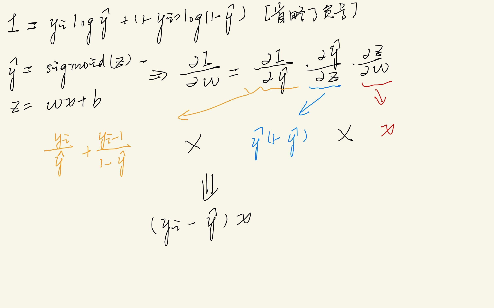

# 机器学习知识点总结

- [1.监督模型](#SupervisedModel)
- [2.无监督模型](#UnsupervisedModel)

## <a id='SupervisedModel'><a/>1.监督模型

### 1.1 SVM
> SVM全名叫支持向量机，是一种十分经典的分类和回归模型，为什么叫支持向量，
> 是因为该模型的最终形式只和支持向量，即那些位于决策面上的向量有关,根据数据
> 的线性可分、线性不可分以及非线性关系，可以将对应的SVM分成硬间隔下的SVM，
> 软间隔下的SVM，以及结合核函数变换下的SVM。
#### 1.硬间隔下的SVM
> 所谓的硬间隔，是针对数据样本线性可分的情况，这个时候我们希望所有的样本都能够
> 正确分出来，并且得到的决策面要最优，怎么去定义这个最优？这个就是SVM里面比较
> 核心的部分，也就是目标函数部分。
1. 目标函数和约束条件
   > 假定最终得到的决策面是两个互相平行的直线y=wx+b（两个是因为一边对应一类，中间的
   > 部分就是类间的差异），我们所要得到的当前是这两个平行直线最大间隔的情况，
   > 对于两类的情况，我们可以简化成一个标签为1，另一个为-1，并且我们希望模型实际
   > 预测的结果也和标签尽可能一致（即两类样本下预测的结果准确而且差异尽可能大），结果
   > 准确对应的方程是y * (wx+b) >= 1，即每一个样本都预测正确，而差异尽可能大
   > 则对应两个分类面的间隔尽可能大，即1/(w)**2尽可能的大，也就是对应w的L2范数的平方
   > 尽可能的小，所以目标函数可以表示为最小化w的L2范数平方，同时带有一个约束条件
   > 各个样本的标签和实际预测的结果乘积要大于1。
2. 求解过程
   > 此时问题转化为了一个在一定约束条件下求某一个目标函数的最优值，对于这类问题，我们常常
   > 通过拉格朗日算子将约束和待求解目标合并在一起，这样就会引入拉格朗日算子alpha，并且
   > 此时问题变成了最小最大化问题（最大化约束，最小化目标），我们的目标是求最优的参数w和b，如果直接对这个最小最大化
   > 问题去求解比较复杂（因为通常求最小化问题直接求偏导即可，凸优化问题），所以这里利用到了
   > 对偶思想（最大化最小的最优解比最小化最大的最优解要小），转化成了最大化最小的问题，此时最小化
   > 过程可以把拉格朗日乘子alpha当成一个固定的值，然后对w和b求偏导，得到各自的表达式，然后带入进行
   > 相当于就是求alpha的最大化，对式子取负，即转换成求最小化的问题，通过SMO算法去求解即可，
   > 即每一次求两个alpha参数，固定住其它的参数。
   - KKT条件
     >  什么是kkt条件，即当我们在求解一个带约束问题的待优化问题的时候，通常我们会将其整合到一个方程式
     里面，这时候对这个方方程式求最小最大化的最优值，满足几个条件，即整个方程关于待优化的参数求导为0，
     等式约束都为0，不等式约束（均为大于等于的）和为0（带上拉格朗日乘子）。
   - SMO算法
     > 最终的优化是要对n个alpha进行计算，同时对n个去算比较复杂，smo的想法是每一次取两个alpha出来，固定住
     其它的alpha。
#### 2.软间隔下的SVM
   > 在硬间隔里面我们是假设所有的样本都能够正确的分类，但是实际里面很难做到如此，很可能存在
> 个别的难分类样本，所谓的难样本即不在最大分类间隔两侧的，即处在分类间隔线内部的样本，对于这样的样本我们所要求 的 
   间隔没有那么苛刻，也即软间隔的概念。
1. 目标函数和约束条件
   > 软间隔本质上体现在约束条件的式子里面，y * (w * x + b) < 1了，即此时的约束条件相比于硬间隔下要放松了，至于放松了多少，这里是给每一个样本设置一个间隔
   参数，即y * (w * x + b) >= 1 - gap，gap越大，说明样本越难分，当gap为0时，和硬间隔就没有区别了；同时我们需要对gap也进行一个不小于0的
   约束。改变了约束条件当然我们不希望这个gap无限制的变化，而是希望gap尽可能的小，所有目标函数里面多了一个对gap的惩罚项，gap前面的参数
   我们称之为惩罚因子C，惩罚因子项可以理解为经验风险（即根据观测数据来得到的模型尽可能使得这些样本的误差尽可能的小，当C越大时，
   模型对训练数据的拟合能力得到加强，太大会过拟合），而前一项对w参数的L2范数平方和可以理解为是结构风险（在分类正确即误差一定的情况下，
   让模型的泛化性更好，这里其实就可以看到模型参数越复杂，越不利于模型的泛化性提升）。
2. 求解过程
   >  求解过程和硬间隔基本一样，对于待优化的目标和约束条件整合到一起，然后最小最大变成最大最小，然后通过对偶问题进行最优值的求解，结合了KKT条件和SMO算法
   得到最优的alpha值，然后就可以表示出w和b了。
#### 3.非线性变化
> 对于非线性即线性不可分的数据样本，我们这时候直接用SVM去求解是不行的，这时候可以尝试对数据样本进行升维处理，即原本的低维已经不足以
> 来区分样本了，这时候就要考虑结合新的特征属性，可以理解成创造新的特征值，本质上一个维度的变化，但是维度一变，就会导致计算的过程变得
> 复杂，有没有一种方式可以使得计算比较简便，这时候核函数就出来了，核函数的本质是不需要计算数据样本在高维上的内积计算过程，而是直接通过
> 低维的映射直接得到高维内积同样的结果，这样做就避免了高维计算，这样做的理论支撑还是SVM最后的最优模型参数由各个数据样本的alpha决定的，
> 而alpha又是由数据样本之间的内积决定的，所以可以通过这样去得到最终的结果
- 常见的核函数
  
      1. 线性核函数：即低维（x1,x2)→x1 * x2  
      2. 高斯核函数: 即低维(x1, x2)→代入高斯形式的函数（x1和x2之间的差平方以及高斯的mu和sigma）  
      3. 拉普拉斯。
      4. sigmoid激活核函数。
### 1.2 感知机算法（二分类算法）
> 一种比较经典的线性二分类算法，我们知道在SVM中的约束条件为y * (w * x + b) >= 1，在感知机里面
的约束变弱了，仅需要y * (w * x + b) >= 0即可，并且感知机里面对于分类正确的样本就不做处理，仅仅对于那些
分类错误的进行梯度更新算法，即仅仅对于那些y * (w * x + b) < 0的点进行计算，变成我们的损失函数的话需要
变负为正，在前面添加一个负号即可。
1. 目标函数
  > 感知机的目标即使得分的错误的样本离分界面尽可能的近，即尽可能使得偏离的间隔要小，所以损失函数也就待优化的
> 目标函数为：
2. 求解过程
  > 根据目标函数以及传入的数据样本，对模型的参数进行梯度更新，这里面对参数求导比较容易，dw即是输入的样本和标签的乘积之后
> 的结果，db即是样本标签，当然我们可以自己去设定学习率。
```python
class Perceptron():

    def __init__(self, feature_dim, activation):
        self.activation = activation
        self.weights = [0 for i in range(feature_dim)]
        self.bias = 0

    def __str__(self):
        '''
        打印学习到的参数
        '''
        return 'Perceptron Weights:\t%s\n Bias:\t%s' % (self.weights, self.bias)

    def predict(self, input):

        return  self.activation(
            reduce(lambda a, b: a + b, list(map(lambda x, w: x * w, input, self.weights)), 0.0) + self.bias
        )
    def train(self, input_vectors, labels, iteraions, lr):
        for iteration in range(iteraions):
            #打包数据和标签
            samples = zip(input_vectors, labels)
            for (input_vector, label) in samples:
                output = self.predict(input_vector)
                self.update_weights(input_vector, label, output, lr)
    def update_weights(self, input_vector, label, output, lr):
				#根据求导结果进行梯度更新，当实际的标签和预测的一样，就不更新
        self.weights = list(map(lambda origin, x: origin - (output - label) * x * lr, self.weights,  input_vector ))
        self.bias -= (output - label) * lr

```

### 1.3 逻辑回归算法（二分类算法）
> 逻辑回归算法是一种典型的概率模型，也是一种判别模型，即直接根据输入的数据样本去预测样本属于其中某个类别的概率大小，
该方法能够有效的本质是最大似然估计（即求解出的模型要能够使得当前观测样本发生的概率最大）

1. 目标函数
    > 这里我们用theta表示模型的参数，那么在theta下我们会对每一个样本估计出属于特定类别的概率，我们假设模型预测
的是属于类别1的概率为p，那么对于那些本身就是类别1的观测样本x1，我们当然希望theta（x1）→p越大越好，而对于非类别1的
其它观测样本x2，我们当然希望概率theta（x2）→p越小越好，对应就是1-p越大越好，联合到一起就可以表示成p * （1 - p）
这种形式，那么如何去表示这个实际的标签呢，直接将标签的信息代入即可，p ** （y）* （1 - p） ** （1-y），当为类别1的
时候就仅仅p起作用，当不是类别1的时候，1-p起作用，都是做大化，为了更方便去表示，这时候取个对数，再加上负数就得到了我们
所要的负对数似然函数，也就是逻辑回归所要优化的目标，即最小化的该损失（添加了负号使得最大化似然概率变成了最小化）。
2. 求解过程
    > 确定了目标函数之后，只需要对要优化的参数w和b求导即可，这里需要链式求导，因为w经过了线性变换→sigmoid激活→
最后的目标函数，所以按照链式求导发现最后w的梯度和均方误差的导数结果基本一致。
   
### 1.4 线性回归算法
> 线性回归即通过对输入样本特征各个属性的线性组合来得到最后的预测值，一般通过预测值和真实值之间的均方误差或者平均绝对误差
来去衡量算法性能的优劣，其中平均绝对误差对异常值不敏感，因为不管是偏离多少，求的导数值都为1，而均方误差对于异常值极其敏感，
因为优化的速度和预测值与真实值之间的偏差有关。  
既然输出是输入和参数的线性组合，那么我们就可以用矩阵的形式来去表示这个过程，即y = w * x，这里的w和x都是矩阵的形式，
其中w的维度为样本特征维度，而x的维度有两个，一个是样本数，另一个是特征维度大小，最终的优化目标则是使得（y - yG）.T * 
(y - yG)尽可能的小，也就所以样本的平方和尽可能的小，因此引入了矩阵自然就会有相应数学方面的推导，这也就涉及到我们常说的
最小二乘法，使得残差平方和最小的参数估计也就是最小二乘估计（注意如果误差也就是每一个样本的残差满足零均值、同方差并且互不相关
的话，那么此时的估计也就是无偏估计了，即无偏性，和实际的参数值没有偏差）
1. 最小二乘法的估计
   > 仍然是对目标函数求导，不过这里用矩阵的形式去表示，求导得到最后的参数w表示如下：
   
     
   可以看出这里需要用到样本矩阵X.T * X的逆矩阵，涉及到逆矩阵的运算，就需要考虑一个矩阵是否存在逆矩阵的问题，什么情况下
矩阵不存在逆矩阵呢？我们知道求逆矩阵可以利用行列式的值来算，当X行列式的值为0时，此时分母将为0，所以此时逆矩阵不存在，这时候
矩阵也被称之为奇异矩阵。当该矩阵可逆的时候，我们直接利用上面的公式求解即可。
   ```python
   import numpy as np
   # 最小二乘法实际在求最佳的参数矩阵W,利用求导可以推出
   # 最佳的w = (x.T * x).R * x.T * y,其中R代表取逆
   def get_best_w(data, target):
       data, target = np.mat(data), np.mat(target)
       print(data.shape, target.shape)
       x_T_x = data.T * data
       if np.linalg.det(x_T_x) == 0.0:
           print("x.T * x的结果为奇异矩阵，不可逆")
           return
       return x_T_x.I * (data.T * target)
   ```
2. 局部加权
   > 通过观测最小二乘法最后参数w的估计项，发现无偏估计的结果只和输入的数据和样本标签有关，是一个固定值，通过这种方式得到
   > 的模型很可能欠拟合，这时候我们可以加入一个修正的矩阵W，来使得估计每一个样本时引入一些偏差，从而降低模型估计的偏差，提高
   > 模型在训练数据的拟合能力。
   
     
   这里的w可以根据需要去选择 ，常用的为高斯核，高斯核的理解为训练集里面离待预测样本越近的样本权重应该更大，反之越小。
   ```python
   def local_weight_LR(sample, data, target, k = 1):
       data, target = np.mat(data), np.mat(target)
       weight = np.mat(np.eye((data.shape[0])))
       for i in range((data.shape[0])):
           difference = sample - data[i, :]
           weight[i, i] = np.exp(difference * difference.T /(-2.0 * k ** 2))
       x_T_W_x = data.T * weight * data
       if np.linalg.det(x_T_W_x) == 0.0:
           print("x.T * x的结果为奇异矩阵，不可逆")
           return
       ws = x_T_W_x.I * (data.T * weight * target)
       return ws
   def local_weight_LR_Predict(data, target, k = 1):
       predict = np.zeros(data.shape[0])
       for i in range(data.shape[0]):
           predict[i] = np.mat(data[i, :]) * local_weight_LR(data[i, :], data, target, k = k)
       return predict
   ```
3. 岭回归
   > 我们知道岭回归也即我们所说的L2正则化，在深度网络模型里面常常用来控制模型的复杂度，防止过拟合，而在线性回归里面引入这一项
   带来的影响其实就是在求最后的参数w时，加入了一个lambda项使得矩阵非奇异，从而可以求逆。  
   
   

   ```python
   def ridge_Regression(x_mat, y_mat, lambda_value = 0.1):
       '''
       岭回归下的线性回归，即当数据样本的特征维度大于样本数，无法求x.T * X的逆的时候,采用岭回归
       最优的参数估计w=（X.T * X + lamvda_value * I）.I * X.T * Y
       '''
       x_mat, y_mat = np.mat(x_mat), np.mat(y_mat)
       x_T_x = x_mat.T * x_mat 
       x_T_x_lambda = x_T_x + lambda_value * np.eye((x_mat.shape[1]))
       if np.linalg.det(x_T_x_lambda) == 0:
           print("奇异")
           return
       w = x_T_x_lambda.I * x_mat.T * y_mat
       return w
   ```
### 1.5 贝叶斯模型
> 前面的几个模型均是判别模型，而贝叶斯是典型的生成模型、概率模型，和逻辑回归同样属于概率模型，那么
两者之间的差别在哪呢？其实差别在于得到预测模型的假设即思考的点不太一样，逻辑回归即典型的最大似然，
通过观测样本估计的模型只要使得观测样本分布出现的概率最大即可，只利用到了观测样本信息；而贝叶斯则在这个
基础上还融入了先验概率，即各个样本类别下的信息（因为实际的分布里面可能存在某一个类别很多，比如现实里面
戴眼镜的远多于不戴眼镜的，在逻辑回归里面，并没有考虑这样一种先验的信息，只考虑从观测样本到实际类别的映射
关系；而贝叶斯里面利用到了这一先验知识，所以这类也被称之为贝叶斯流派）
1. 目标函数
   > 对于每一个类别下，都建立一个相应的模型来去刻画这个类别下样本的分布，然后在预测新样本的时候，将新样本
   传入到每一个类别的模型下，最后去根据最大概率的来去判断类别：
     
   这里用到了朴素贝叶斯的思想，即假设样本特征里面各个属性是互相独立的，这样就可以计算类别条件概率了。
2. 求解过程
   > 对于贝叶斯模型，关键在于对每一个类别下的概率模型求解出来，对于离散的特征值，我们通常可以直接算该类下
各个离散值出现的频率作为概率，然后所有的求解出来就构成了一个概率模型；对于连续的特征值，我们通常可以采用高斯
模型来刻画，通过计算各个维度上的属性值的均值和方差，得到每一个类别下各个属性的概率模型（高斯分布）。  
   > 求出来了各个类别下的概率模型，直接对于待预测的样本，将类别的先验概率和类条件概率计算，得到样本属于
各个类别下的概率，最后取最大的即可。

   ```python
   def classify_Bayes_log(sample_vec, prior, condition):
    '''
    根据先验和条件概率估计待预测样本的所属类别
    Args:
        sample_vec: 样本向量
        prior:先验概率
        condition:条件概率
    Return:
        probs-样本属于各个类别的概率
    '''
    probs = dict()
    for label in prior.keys():
        probs[label] = reduce(lambda x, y: x + y ,[sample_vec[i] * condition[label][i] for i in range(len(sample_vec))]) + math.log(prior[key])
    if probs[0] > probs[1]:
        return 0
    
    return 1
   ```
3. Trick
   - 处理离散特征值时容易出现稀疏的情况：个别属性值基本没咋出现，或者干脆就没有出现，这样会导致在预测
   样本的时候出现0的情况，导致很多概率为0，这种是不希望看到的，可以加入拉普拉斯平衡，其实就是在分子
   上初始化的时候对于离散值出现次数初始化为1即可。
### 1.6 决策树
> 决策树是一种利用树状结构来去对数据做分类或者回归的概率模型，每一个树的结点可以看作是特征的某个属性值的分界点，通过层层分裂结点生成最终的
树模型，最后的叶子结点即我们所要预测的类别或者分数，决策树模型里面关键的在于结点分裂的准则（本质上就是特征的选择）。
1. 结点分裂准则（也可以理解为寻找最优决策的过程）
   > 为什么要分裂结点，无非是让分裂后的样本子集更容易区分和判别，分裂其实就是特征的层次筛选，符合某一条件的分到一边，符合另一条件的分到
一边，所以结点的分裂本质上就是选择最优判别（这里的最优理解为最具判别性）的特征属性，通过这样筛选能够让符合某类似分布的样本被分到一边，也就是
我们所说的判别，所以如何选择特征是决定决策树性能好坏的关键因素。
   - 信息熵准则（ID3树)
     > 所谓的信息熵，在信息论里面其实有所定义，本质上就是衡量样本分布的不纯度，样本越纯净（即样本基本都属于某一个类别），那么这批样本的
   信息熵将越小，即我们从里面所能获取的信息（不确定度）将很小；而如果样本十分混乱，那么肯定对应的熵很大，即不确定度就很高了。对于待训练的数据
   样本，里面肯定存在各个类别的样本数据，这时候可以理解为是一个十分不纯的集合，而我们最终是要能够对不同类的样本进行尽可能准确的区分，也就是
   不同类别的样本尽可能属于各自的子集合里面，这样对应每一个子集合就比较纯，也就是说明我们所分类的比较准确，所以信息熵准则就是以分裂前后样本集合
   的信息熵变化为准则（分裂前是一个样本集合，分裂后是两个子集，对子集的信息熵计算和分裂前的比较），如果信息熵减少的越大，那么说明分裂之后得到的
   子集就越纯，我们希望看到的就是这样的结果。
   - 信息增益比率准则（C4.5)
     > 只用信息熵准则作为分裂的准则，会出现一个问题， 即结点的分裂倾向于去选那些属性值较多的样本，即产生分支较多的属性值，因为很直观，子集的数量
   较多的话，计算的熵往往就比较小，因为每一个子集比较小，自然里面的肯定就比较纯了，但是这样往往会导致过拟合的现象，比如人的身高范围在140-190，那么
   按照信息熵的准则有可能就对每一个段的身高值都作为一个分支，使得每一个分支里面都只含一个性别的人，这样会导致纯度很高，即信息熵减少的最多，但是显然
   这样去分不太合理，即严重的过拟合了，而信息增益就是为了避免这种情况的发生，让结点的分裂不光考虑前后集合的信息变化程度，还考虑到分裂分支的数目，
   信息增益会抑制那些分裂分支数目多的情况，具体怎么抑制的呢，其实就是对原始的信息熵除了一个系数，这个系数是根据分裂后的子集大小以及子集数目计算出来的
   一个子集的熵表示，即不是在每一个子集里面算一个熵出来，而是每一个子集看成一个样本，计算一个子集分布的熵，那么子集数目越多的话会导致这个值越大，会抑制
   整体的增益值，从而减弱了信息熵出现的过拟合现象。
   - 基尼系数准则(Cart树)
      >  所谓的基尼系数其实就是算出分裂之后对各个子集的样本再进行分类分错的概率（选择该子集的概率乘以判断成其它子集的概率），对于基尼系数准则，当然
   是选择基尼系数越小的越好。

### 1.7 随机森林（集成学习里面bagging = boostraping aggregation的代表）
> 随机森林是一种典型的集成学习的思想，集成的是不同的决策树，之所以称之为bagging，是因为这些决策树的生成是并行生成的，即决策树（弱学习器）之间不存在依赖
的关系，因为每一颗决策树都是在原始的数据里面经过采样得到的，即每一颗决策树都是一个单独的弱学习器，通过并行的学习得到这么多的弱学习器的组合，最后整体表现出
强的学习能力，即用弱的组合得到强的能力，最后的预测用这些弱学习器经过投票来表示。

### 1.8 Adaboosting（集成学习里面boosting的算法）
> Adaboosting字面意思可以理解成一种自适应的boosting算法，至于为什么这里是boosting和adaptive，则是该算法的核心。  
Boosting：每一次的学习器的生成都是在上一次学习器的基础上训练得到的，所以boosting可以理解为是一个让单一的学习器学习能力不断增强的含义，
所以adaboosting就是一个只能串行训练的算法，每一次用的数据都是同一批。  
Adaptive：自适应这里的含义是，对于每一次学习器的训练，都会根据训练模型在样本上的整体表现调整学习器的权重、根据样本上的单独表现调整样本的权重，这就是自适应的
体现，即会根据实际的性能去调整占比，最后训练完成之后会利用所有不同权重的学习器的预测结果表示最终的结果。
### 1.9 GBDT(boosting算法，Cart树的应用)
> GBDT也是集成学习方法里面boosting算法，之所以叫Gradient Boosting Decision Tree，是因为GBDT过程中每一棵决策树都是预测前一棵决策树预测的残差，
因为当前决策树的预测结果加上前面预测的结果即为当前预测的最终结果，通过泰勒展开公式，展开到一阶部分，然后发现一阶部分只和前面预测结果的残差有关，所以GBDT
本质上就是拟合残差，即朝着这个方向去优化模型。
### 1.10 XGBoost（boosting算法）
> 相比于GBDT，XGBoost可以看作是一种工程化的实现，对GBDT做了一些改进而已。
1. 利用到了二阶的信息
   > GBDT里面的残差其实可以理解为是一种一阶的信息，而XGBoost里面将泰勒展开式往后又延申了一层，即到了二阶的部分，所以相比于GBDT模型优化的效率更高了。
2. 树的正则化
   > 即控制了模型的复杂程度
3. 列采样
   > 我们知道，对于决策树的结点分裂是比较耗时的工程，因为要遍历所有的特征，寻找最优的特征值作为分裂点，XGBoost里面将特征进行了采样，即让多个不同的机器
来去计算不同的特征值对应的分裂增益，这样最后只需要对于最好的特征属性进行记录，然后在对应的机子上进行分裂并传播给其它机子。
4. 节点分裂点的选择
   > 如果对于某一个特征属性的所有可能取值一一去看，时间开销将会很大，XGBoost里面采用的是采样的方式，即对于取值范围里面的点进行分位取法，比如对于体重值
40-90，不是逐个都取，而是每隔5个数取一个，这样能够减少计算量。
5. 稀疏感知（对于特征属性值出现大量0的情况）
   > 当样本的特征值里面出现很多位置为0的情况，XGBoost里面会将这些0和缺失值一起处理，绑定在一起，在结点分裂的时候，看将绑定的数据放到哪一边效果更好，则
最后放到哪一边上。
### 1.11 LightGBM(boosting算法工程化的经典实现)
> LightGBM可以看作XGBoost更轻量化的实现，更高效、高准确，高效体现在相比于XGBoost里面多机通信带来的时间开销比较大，
1. 基于直方图去做最优结点的选择
   > 对于样本里各个特征值的选择，这里采用将值的区间化成等k份，然后统计各个区间的频数，最后用这k个离散的值作为分裂点选择时要计算的k个值，相比于计算原始所有
的值大大降低了计算量。
2. 采用leaf-wise
   > 对于之前的决策树分裂方法，都是level-wise的方式去分裂，即每一次对同一层的结点进行分裂，这样其实是不准确的，因为有些结点即使是处于同一层级，但是分裂带
来的增益可能相差很大，所以这样做会导致不必要的时间开销，而leaf-wise是找所有叶子结点里面分裂增益最大的来分裂，相比于之前的能够减少误差，但是容易过拟合。
3. 单边梯度采样算法
   > 本质上是为了减少计算量同时保持精度的情况下做的一个改进，即保留那些梯度比较大的，梯度大的对应对信息增益帮助更大，所以这里面就将一些较小梯度对应的样本不进行
丢弃，保留那些大的梯度样本。
4. 支持了类别特征的直接输入
   > 一般类别特征我们都需要进行编码处理，典型的就是独热编码，但是这样做往往会导致不平衡的切分（即某一个属性的值比较多，但是每一个类下又比较少，这时候不管
以该属性的哪一个值来进行结点的分裂，都会导致增益很小，就会导致该属性被浪费了，没利用到），LightGBM采用的many-vs-many的方式去处理（待补充）。
5. 特征并行的改进
   > 和XGBoost一样，也是在每一个机子上去找局部特征子集的分裂点，然后合并找到最优的，但是LightGBM里面最后并不是用数据传播的方式将最优分裂结点所在的机子的数据
传到其它机子，而是每一个机子都有全部的数据，直接根据最优分裂结点分裂即可。

### 1.12 KNN
> KNN,最近邻算法，是一种十分简单的有监督算法，利用样本附近最近的K个样本中类别占比最大的作为分类的结果。
### 1.13 LDA
> LDA全称叫做线性判别分析，为什么是线性呢，因为该方法本质上是求一个最佳的线性向量W使得原数据被映射到一条直接上，并且使得同类里面的数据样本尽可能靠近，
不同类的样本尽可能远离。
- 具体步骤：
  1.求类内的协方差矩阵→类内散度（散度少一个除以样本数量-1的过程），本质上就是求类内样本数据各个维度上的协方差，刻画了各个属性之间的关系.
  2.计算类间的散度矩阵：两类情况下直接根据类中心计算协方差即可。
  3.通过类内和类间的散度矩阵来表示最终要生成的变换向量W（利用最大化变换后的类间散度和最小化类内散度来得到，这里也称作广义瑞丽商）。
## <a id='UnsupervisedModel'><a/>2.无监督模型
> 所谓的无监督模型即在数据样本没有标签下的一种训练模型的方式。
### 1.聚类算法
#### 1.1K-means(原型聚类方法)
   > K-means是典型的无监督模型，也是EM(期望最大化)方法的典型代表。所谓的无监督模型，是因为K-means里面不需要用到
标签，K-means的步骤如下：
   - 随机选择k个点作为各个类的中心。
   - 计算各个样本离这K个类中心的距离，选择最近的作为该样本的类。
   - 对这K个类子集的样本算均值，均值作为该类子集的新的中心。
   - 一直迭代直到满足新中心和旧中心的差别小于某个阈值就停止
   - 源码
     ```python
        '''

        K-means ：无监督聚类算法
        '''
        import numpy as np
        import matplotlib.pyplot as plt
        def get_data(sample_nums, dim):
            '''
            生成无监督的数据
    
            '''
            x = np.random.randn(sample_nums, dim)
            # c = np.zeros([sample_nums, 1])
            return x
        def kmeans(data_x, k):
            """
        
            """
            #load the data
            n, d = data_x.shape
            categories = np.zeros(n)
            centers = np.random.choice(k, d, replace=False)
            centers_old = centers.copy()
            lr = 0.5
                #visualize the data
            plt.scatter(data_x[:, 0], data_x[:, 1], c =categories)
            plt.show()
            variations = 1
            while variations > 0.000001:
                #update the class for each sample according the distance with the center
                for i in range(n):
                    distance_min = float('inf')
                    for j in range(k):
                        distance = np.linalg.norm(data_x[i] - centers[j])
                        if distance < distance_min:
                            categories[i] = j
                            distance_min = distance
    
                #updata the class center
    
                for i in range(k):
                    mask = (categories == i)
                    center_old = centers[i]
                    centers[i] = np.sum(data_x[mask], axis = 0)/(mask.sum() + 1e-6) * lr + center_old * (1-lr)
                #visualize
    
                plt.scatter(data_x[:, 0], data_x[:, 1], c = categories)
                plt.plot(centers[:, 0], centers[:, 1], 'r+')
                plt.show()
                variations = np.sum(np.square(centers - centers_old), axis=1).sum()/k
                centers_old = centers.copy()

            if __name__ == "__main__":
                data = get_data(100, 2)
                kmeans(data, 3)
     ```
   > 至于什么是EM算法，个人理解是，我们训练模型的本质上是根据已有的观测样本分布来去预测真实样本的分布，因为我们不知道
真实的分布是什么，那只好通过观测样本的分布去拟合一个模型降低训练的误差，训练样本的误差低不是根本目的，真正想实现的是泛化
误差，即在真实分布上的误差。在观测样本缺失部分信息的情况下（这里表现在不知道实际的标签），我们该怎么去处理呢？K-means这里
就是提出一个假设，即对观测的样本的类别做一个假设（体现在类中心的确定过程,通过做假设，可以得到隐状态的分布估计，这里就是指估计
的类别中心各个我们再可以通过估计的隐状态来去推模型的参数，这个推导是根据最大化期望来推出的，因为隐状态的分布概率我们是知道的，在这样一个分布下我们可以
去选择一种最大化期望即最小化风险的结果作为模型的参数，如此得到新的模型参数又可以得到新的隐状态分布），在假设的基础上去对模型进行迭代更新，使得整体
的期望尽可能的大（理解为尽可能的贴近真实的分布）。【混合高斯模型的训练过程也可以认为是一种EM方法的具体体现，通过对样本进行 
> 一定的假设】[EM算法](https://zhuanlan.zhihu.com/p/78311644)
- [中心优化：K-means++](https://www.cnblogs.com/pinard/p/6164214.html) 
  >对K-means的初始聚类中心进行优化,不再是对所有的聚类中心随机初始化，而是先随机选择一个，然后其它的类中心要尽可能和这些已经
选择的要远
- 距离计算优化：elkan K-means
  > 
- 大样本优化：Mini Batch K-means
  > 当样本数量过大的时候，直接去做聚类的化计算量十分大，这时候通常可以将大的数据样本分成小的batch来处理，最后选择这些batch
里面得到的最优的聚类簇。
#### 1.2[BIRCH](https://www.cnblogs.com/pinard/p/6179132.html)  （层次聚类方法）
  > 
#### 1.3[DBSCAN](https://www.cnblogs.com/pinard/p/6208966.html) (密度聚类)
   > 利用密度的思想，让所有密度可达（即样本之间的距离满足一定的关系，涉及到密度），形成最终的簇群，得到分类的结果。
   

### 2.特征降维

#### 2.1 PCA
> PCA的全称为Principle Component Analysisi，即主成分分析，改方法的作用是对数据样本的特征进行降维，提取具有代表性的
特征出来，具体的步骤如下：
   - 计算所有数据样本的均值
   - 计算数据样本的协方差矩阵，代表了数据样本各个特征维度上的协方差，协方差越大说明越相关，说明这两个特征维度上的值呈现一致性
的变化，即你大我也大，因为协方差的公式是对两个变量减去各自的均值然后求期望，所以如果两个变量变化趋势趋于一致，即相关性较大，那么说明
这两个变量的相关性较大。
   - 计算协方差矩阵的特征值和特征向量，并按照特征值的大到小进行排列，取前k个较大的对应的特征向量构成一个矩阵k * d
   - 对原始的数据进行一个线性的变换，即右乘一个上一步得到的矩阵的转置，从而实现了维度的降维。
#### 2.2 SVD
   > 奇异值分解是针对特征值分解只适用于方阵的局限性而提出的方法，当矩阵非方阵的时候，将矩阵分解成左酉（you）矩阵和右酉矩阵，
其中左大小为M * M， 右大小为 N * N，怎么去求左和右呢，其实只需要将原矩阵和矩阵的转置求特征值和特征向量就是左矩阵的向量构成，
原矩阵的转置乘以原矩阵求特征值和特征向量就是右矩阵的构成，而对于中间的奇异值矩阵的奇异值，我们只需要求对角线的元素值即可，
奇异值和原始矩阵A.T * A的特征值有开方的联系，所以只需要求A.T * A的特征值即可。


## 3.其它典型的模型

### 1.HMM模型
> HMM模型也叫做隐马尔可夫模型，相比于马尔可夫模型多了一个隐的表示，这个隐表示的是隐状态，即我们看不见的状态，马尔科夫链里面描述的
是不同状态之间的转移过程，比如今天晴天，明天雨天，后台阴天，每一个状态下都会有相应的状态转移矩阵；而HMM模型里面还多了一个隐藏的
状态，可见的一般只有观测的状态，比如可见的是一天所做的事情，而不可见的是天气，我们需要根据观测的序列去估计隐状态；或者根据观测、隐状态
序列对实际的模型进行建模，所以HMM模型的相关问题并非绝对的监督或者无监督问题，视具体的问题具体处理。
- 生成模型的解释：
  > 我们知道生成模型和判别模型是机器学习里面常见的两大类别，什么叫生成模型呢，所谓的生成即在给定一个状态或者给定一个类别下去求的改类别或者
状态下的分布，典型的就是贝叶斯模型，而这里的HMM模型也是一种生成模型，因为HMM模型里面核心的几点是：初始状态（隐状态）、状态转移、状态发射（一个
隐状态下发生某件事的概率），所以可见在确定了当前状态的情况下，事件发生的分布就是确定的，因此和贝叶斯方法的理论也是一致的，即确定各个类别下
的分布，然后用这个分布去判断新来的数据属于哪个类别的概率大，只不过这里是序列模型，即状态是连续的，但是我们发现HMM里面虽然当前的状态是和前面
的状态有关的，但是一旦确定下来之后，当前时刻的事件发生分布情况也就确定下来了，即发射矩阵，我们只需要求各个状态下发生当前事件（观测状态）的概率
大而判断隐状态是啥，和贝叶斯的本质是一样的，并且各个观测是独立的，什么叫独立呢，即一旦隐状态确定下来，各个观测事件的发生就互不影响了。
- 求解过程的理解：
  > HMM模型的求解可以看成是在之前的序列信息基础上，去估计各个隐状态和当前观测事件联合发生的概率，取最大的作为估计的结果，因为隐状态是要估计的，
所以各个隐状态下的联合概率都要求，这里是将隐状态信息联合观测信息生成一个分布，所以是一种生成模型，即在各种隐状态类别下生成得到各自的分布，最后比较
联合的结果得到的。
### 2.MEMM模型
> HMM是一种生成模型，即当前的隐状态一旦确定，那么可以算出该隐状态下观测事件发生的概率，可以理解成是一个联合概率；而MEMM模型则改变了一种
方式，即直接根据观测的事件去预测隐状态发生的概率，可以理解为是一种判别模型，即直接根据数据样本去估计状态，在前面序列信息的基础上，利用当前
的观测事件，直接去估计隐状态的信息，看作输入是当前观测事件状态+前面序列的信息，是一个直接由输入样本到输出标签的过程。
- 与HMM的比较(打破了观测独立的假设)
    

### 3.条件随机场
> MEMM虽然打破了观测独立的假设，但是没有解决label bias的问题，什么是label bias，可以理解为根本原因是我们真实的目标与建模的目标不一致，
导致模型最终求得的输出和我们真实想要的输出存在偏差。体现在联合概率分布上就是，真实想要的分布应该是全局归一化得到的。而建模得到的分布是局部归一化得到的。

> 这里面的标注可以理解为就是隐状态，而实际的词就是观测的序列，我们需要通过观测的序列和标注来去得到一个模型，用这个模型来处理待预测序列的信息，预测
我们想要的东西，比如根据序列预测各个词的词性等，HMM里面是求各个隐状态下发生观测序列的联合概率，然后取最大的隐状态序列作为预测的；而MEMM里面是
根据观测序列来去统计条件概率，并且是链式的求通过局部的得到最终的概率值；而CRF里面则是在全局里面将各个转移概率和条件概率当成输入得到一个全局的概率，
是一种无向图模型。

## <a id=''><a/>3.特征工程部分

### 1.特征选择

- 过滤式选择
> 直接根据选取的过滤准则对特征进行一个筛选。
  - 方差法
    > 计算不同特征的方差，即对于不同样本来说，该特征的变化差异程度，对于那些方差很小的，即样本不同带来的变化极其小的可以
> 剔除掉，只保留那些方差较大的特征。
  - 相关系数法
    > 计算各个特征和目标之间相关系数，相关性越高的特征应该被保留下来。
  - 假设检验（卡方、t分布等）
    > 对原始的数据分布作出相应的假设，然后针对假设和实际之间的差值去进行相应的验证。
  - 互信息
    > 计算不同特征之间或者特征和标签之间的互信息，即两种变量之间的关联程度。
>
- 包裹式选择
> 所谓的包裹式选择即将最终评估的一个指标作为一个筛选的标准，典型的比如就是决策树里面结点的分裂过程，前向和后向的过程可以看作
是一个包裹式的选择过程。
- 嵌入式选择
> 将特征的选择隐含的囊括在模型的训练过程中，典型的就是L1和L2正则化的过程。

### 2.特征构造

###3.特征降维
> 主要是以PCA和LDA为主的方式。

## <a id='Projects'><a/>4.典型作业和项目总结

### 1.鸢尾花的二分类问题(感知机分类)
> 根据所给的鸢尾花的数据集，要求对鸢尾花进行一个分类，其中鸢尾花数据集里面会给一些常用的属性数值，比如花瓣长度等。   
> 对于这类特征属性不多的比较简单的分类问题，可以采用感知机这种较为简单的模型进行尝试，如果效果不好再可以更换支持向量机
或者随机森林等这些更为复杂的模型，这里以感知机作为例子作为说明。
- 数据的预处理部分（读数据、归一化、划分训练测试）
```python
import numpy as np
#加载数据
def load_data():
    data_x = []
    data_y = []
    with open("iris.data") as f:
        for line in f.readlines()[:100]:
            flower_feature = list(map(float, filter(lambda x: x,line.strip().split(',')[:4])))
            flower_label = line.strip().split(',')[-1]
            if flower_label == "Iris-setosa":
                data_y.append(-1)
            else:
                data_y.append(1)
            data_x.append(flower_feature)
    return data_x, data_y
#归一化
def normalize(x):
    x = np.array(x)
    x_mean = np.sum(x, axis= 0)/len(x)
    x_variance = np.sum(np.square(x - x_mean.reshape(-1, 4)), axis=0)/len(x)
    x = (x - x_mean)/x_variance
    return x
#划分数据集
def split_train_test(data_x, data_y, test_ratio = 0.2, feature_dim = 2):
    data_x, data_y = np.array(data_x), np.array(data_y)
    data_x = data_x[:, :feature_dim]
    random_index = np.random.permutation([i for i in range(len(data_x))])
    sample_num = len(data_x)
    train_x_index = random_index[:int(sample_num * (1- test_ratio))]
    test_x_index = random_index[int(sample_num * (1- test_ratio)):]
   #sample_num  = len(data_x)
    train_x = data_x[train_x_index,]
    train_y = data_y[train_x_index,]

    test_x = data_x[test_x_index, ]
    test_y = data_y[test_x_index, ]
    return train_x, train_y, test_x, test_y
```
- 建立感知机模型
```python
class Perceptron:
    #初始化感知机的参数，w和b
    def __init__(self, input_dim = 4, output_dim = 1):
        self.acticvation = activation
        self.input_dim = input_dim
        self.weight = np.random.randn(input_dim, output_dim)
        self.bias = np.random.randn(output_dim)
        self.lr = 0.5
    #预测单个样本，即输入和w进行点乘，再加上偏置
    def predict_sample(self, x):
        output = np.array(x).dot(self.weight) + self.bias
        output[output > 0] = 1
        output[output < 0] = -1
        return output
    #前向传播过程
    def forward(self, sample, label):
        sample, label = np.array(sample).reshape(-1, self.input_dim), np.array(label).reshape(-1, 1)
        output = sample.dot(self.weight) + self.bias
        output_label_mul = output * label
        #得到错误的标记
        mask = (output_label_mul < 0)
        if sum(mask.reshape(-1,)) != 0:
            output_error = output[mask]
            #反向传播
            self.backward(output_error, label[mask], sample[mask.reshape(-1), ])
    def backward(self, error_predict, label, x):
        #error_predict = error_predict.reshape(-1, 1)
        label = label.reshape(-1, 1)
        x = x.reshape(-1, self.input_dim)
        self.weight += self.lr * (x.transpose().dot(label))
        self.bias += self.lr * label.sum().reshape(-1)

```
- 训练
```python
def train():
    x, y = load_data()
    x = normalize(x)
    train_x, train_y, test_x, test_y = split_train_test(x, y)
    visualize(train_x, train_y)
    print("Sample feature dimensions:", len(train_x[0]))
    print("Training sample numbers:", len(train_x))
    print("Testing sample numbers:", len(test_x))
    epochs = 50
    model = Perceptron(input_dim= len(train_x[0]), output_dim= 1)
    for epoch in range(epochs):
        model.forward(train_x, train_y)
        accuracy = test(model, test_x, test_y)
        print(f"Epoch{epoch} accuracy {accuracy:.2f}")
```
### 2.逻辑回归分类

- 建立逻辑回归模型
```python
class Logistic_Model(object):
    
    def __init__(self, input_dim, activation_func = lambda x: 1.0/(1 + np.exp(-x))):
        self.weight = np.random.randn(input_dim, 1)#np.array([[0.48],[-0.61]])
        self.bias = np.random.randn(1)#np.array([4.12])
        print("初始化的参数W为：", self.weight, "\n参数b为：", self.bias)
        self.activation = activation_func
        self.lr = 0.001
    def __call__(self, x, y, grad_variation = 'Once_All', backward = True):
        '''
        grad_variation: "Once_All"-每一次梯度更新将整个数据集传进去
                        "SGD"-随机梯度下降，每一次传一个样本，收敛的更快
        '''
        return self.forward(x, y, grad_variation = 'Once_All', backward = backward)
    def predict_sample(self, x):
        return self.activation(x.dot(self.weight) + self.bias)
    def forward(self, x, label, grad_variation = 'Once_All', backward = True):
        if grad_variation == 'Once_All':
            self.predict = self.activation(x.dot(self.weight) + self.bias)
            if backward:
                self.backward(x, label)
        elif grad_variation == 'SGD':
            nums = x.shape[0]
            all_indexs = [0 for i in range(nums)]
            for i in range(nums):
                rand_index = int(random.uniform(0, len(all_indexs)))
                self.predict = self.forward(x[rand_index])
                if backward:
                    self.backward(x[rand_index], label[rand_index])
                del all_indexs[rand_index]
        return self.predict
    def loss(self, predict, label):
        loss = -(label * np.log(predict) + (1 - label) * np.log(1 - predict)).sum()
        return loss
    def backward(self, x, label):
        #print("更新前参数[Weight:", self.weight, "]"+ "参数[Bias:", self.bias, "]")
            self.weight -= self.lr * x.transpose().dot((self.predict - label.reshape(-1, 1)))
            self.bias -= self.lr * (self.predict - label).sum()
                
        #print("更新后参数[Weight:", self.weight, "]"+ "参数[Bias:", self.bias, "]")
    def eval(self, x, label):
        predict = self.predict_sample(x)
        predict = predict.reshape(-1,)
        label = label.reshape(-1,)
        mask = (predict > 0.5)
        mask2 = (predict <= 0.5)
        predict[mask] = 1
        predict[mask2] = 0
        accuracy = (predict == label).sum()/(label.shape[0])
        return accuracy

x = data
y = label
model = Logistic_Model(2)
epochs = 100
for epoch in range(epochs):
    pred = model(x, y, grad_variation = 'Once_All')
    #model.backward(x, y, grad_variation='SGD')
    train_accruacy = model.eval(train_x, train_y)
    test_xaccuracy = model.eval(test_x, test_y)
    print(f"Epoch {epoch} 训练准确率 {train_accruacy * 100}%, 测试准确率{test_xaccuracy * 100}%")
print("参数W为：", model.weight, "\n参数b为：", model.bias)

```
### 2.垃圾邮件的分类（贝叶斯分类器）
> 利用先验知识来去估计样本的后验概率是贝叶斯的核心思想，而朴素的核心是体现在样本里面的各个特征是独立互不影响的，
这样就比较方便算各个类别下的条件概率。对于邮件，比较难处理的是邮件的内容，我们需要对邮件里面的文本进行提取，并转换成
对应的vector表示。

- 文本数据的提取（利用jieba库自带的分词功能）
```python
import jieba
#加载哈工大的停用词和中文的停用词
hit_words_path = './stopwords-master/hit_stopwords.txt'
chinese_words_path = './stopwords-master/cn_stopwords.txt'
hit_words =[line.strip() for line in open(hit_words_path, 'r', encoding='utf8').readlines()]
chinese_words =[line.strip() for line in open(chinese_words_path, 'r', encoding='utf8').readlines()]
filter_words = hit_words + chinese_words
# print(hit_words)
# print(chinese_words)

    
def load_news_data(file_path, label_file, filter_words):
    fold_label = dict()
    with open(label_file, 'r', encoding='utf8') as f:
        for line in f.readlines():
            line_split = line.strip().split('\t')
            #print(line_split)
            fold_label[line_split[0]] = line_split[1]
    news_labels = []
    news_data = []
    for fold in os.listdir(file_path):
        for txt in os.listdir(os.path.join(file_path, fold)):
            with open(os.path.join(file_path, fold, txt), 'r', encoding='utf8') as f:
                raw = f.read()
            word_cut = jieba.cut(raw, cut_all = False)            #精简模式，返回一个可迭代的generator
            word_list = list(word_cut)                            #generator转换为list
            #word_list = preprocess(word_list, filter_words)
            news_labels.append(fold)
            news_data.append(word_list)
    return news_data, news_labels, fold_label
original_data, news_labels, truth_label = load_news_data('./SogouC/Sample', './SogouC/ClassList.txt', filter_words)
```
- 文本数据的预处理（分完词之后需要对一些词进行剔除，比如空白符之类）
```python
def preprocess(txts_list, filter_words, highfre_words):
    '''
    对文本进行预处理，过滤掉那些属于停用词的词,注意\u3000代表全角的空白符 ,\xa0是不间断空白符
    Args:
        words_list:单个文本的词列表
        hit_words:停用词表
    Return:
        过滤掉的文本
    '''
    rule = re.compile('\s')  #是匹配所有空白符，包括换行适用于\u3000 \xa0，\S 非空白符，不包括换行。
    rule2 = re.compile('nbsp')
    ans = []
    for txt in txts_list:
        txt_new = []
        for word in txt:
            word = word.strip(b'\x00'.decode()).strip()#去除\x00这类
            if not word: continue #空的直接跳过
            if word not in filter_words and not rule.match(word) and word not in highfre_words and not rule2.match(word):
                txt_new.append(word)
        ans.append(txt_new)
    return ans
import collections
#统计一下各个词前后处理过后出现的频数
words_all = []
for sentence in original_data:
    for word in sentence:
        words_all.append(word)
words_count = collections.Counter(words_all)
words_rank = sorted(words_count.items(), key = lambda x: -x[1])

highfre_words = []
news_data = preprocess(original_data, filter_words, highfre_words)

words_all_filter = []
for sentence in news_data:
    for word in sentence:
        words_all_filter.append(word)
words_count_filter = collections.Counter(words_all_filter)
words_rank_filter = sorted(words_count_filter.items(), key = lambda x: -x[1])

```
- TextToVector（粗暴利用onehot编码的形式）
```python

def txtTovector(sentence, words_list):
    """
    根据词字典将单个句子转换成对应的向量
    Args:
        sentence:单个的句子组成，由单词构成的列表
        words_list:存放所有出现过的单词
    Returns:
        返回一个列表表示句子向量，对应位置为1表示对%alias的单词存在于句子中
        example:
        实际的句子：['my', 'dog', 'has', 'flea', 'problems', 'help', 'please']
        返回的形式：[0, 0, 0, 0, 1, 0, 0, 0, 0, 0, 1, 0, 1, 1, 0, 0, 0, 0, 0, 0, 0, 0, 0, 1, 0, 0, 0, 0, 0, 0, 1, 1]
        
    """
    vector = [0 for i in range(len(words_list))]
    for word in sentence:
        if word in words_list:
            vector[words_list.index(word)] = 1
    return vector
#根据词条创建所有词的词字典，然后根据字典每一个句子可以转换成一个向量的形式
def createword_dicts(all_words, delete_N, size_limit = 1000):
    '''
    Args:
        all_words:全部的词汇列表【已经排序过】
        delete_N:删除高频词汇的数量
        size_limie:生成文本向量的长度限制
    Returns:
        最终用于训练的词汇表，用来生成文本向量
    '''
    size = 0
    words_list = []
    for index in range(delete_N, len(all_words), 1):
        if size > size_limit: break
        if not all_words[index].isdigit() and 1 < len(all_words[index]) < 5:
            words_list.append(all_words[index])
        size += 1
    return words_list
def newsTovectors(sentences, words, size_limit = 1000):
    """
    将所有的文本即句子转换成向量的形式
    Returns:
        返回所有句子的向量
    """
    words_list = createword_dicts(words, delete_N = 100, size_limit = size_limit)
    vectors = []
    for sentence in sentences:
        vectors.append(txtTovector(sentence, words_list))
    return vectors
```
- 构建贝叶斯模型（本质上就是计算先验和条件概率）
```python

def Calucate_prior_condition_laplacian(samples, labels):
    '''
    通过已知的样本向量和样本标签计算各个类别的条件概率以及先验概率【原始形式，不加拉普拉斯平滑，如果某个类别下某个特征出现的次数为0，那么这一项就是为0，所以最后的
    条件概率求出来比较稀疏】
    Args:
        samples:样本向量
        labels:样本标签即类别
    Returns:
        prior-字典，存储0和1的先验概率
        condition-字典，存储各个类别下的条件概率，比如[0.2, 0.3, 0.4,0.1]说明的是类别0下各个单词出现的概率是这么多，假如新的单词为[1, 0, 1, 0],那么p(x|y)
        可以算出来为0.2 * 0.4，即对应相乘，然后再乘以类别概率即可，此时概率加了log处理，所以只需要累加即log(0.2) + log(0.4)
    '''
    prior = collections.defaultdict(int)
    condition = {0:[1 for i in range(len(samples[0]))], 1:[1 for i in range(len(samples[0]))]}
    for sample, label in zip(samples, labels):
        if label == 0:
            condition[0] = [condition[0][i] + sample[i] for i in range(len(sample))]
            prior[0] += 1
        else:
            condition[1] = [condition[1][i] + sample[i] for i in range(len(sample))]
            prior[1] += 1
    for key in prior:
        prior[key] = prior[key] / len(samples)
        for i in range(len(condition[key])):
            condition[key][i]/= (sum([sum(samples[i]) for i in range(len(samples)) if labels[i] == key]) + 2)#每个位置即每个特征的统计值除以总的值，使得加起来概率能够为1
            condition[key][i] = math.log(condition[key][i])
    return prior, condition
```
### 3.贷款的预测分析
> 根据用户的相关信息比如性别、结婚与否、教育经历等去预测用户是否贷款，做数据分析最关键的就是对数据的预处理和特征工程。
- 预处理操作
> 主要包括缺失值的处理、对object类型的数据进行编码（独热编码、序数编码）
- 特征工程
> 可以进行相关性的分析，剔除一些无关紧要的特征，也可以对某些特征进行一个组合，降维，根据实际的场景去做，这里将贷款的时间
和数量进行了一个乘积，就使得特征的维度得到控制。
- 训练部分
> 首先是模型的选取；然后是训练的技巧，可以采用留出法、交叉验证等训练方式去得到模型，同时选取合适的评估函数，分类任务通常选取
精确度、召回率、F1 score、交叉熵损失来评估；而回归任务则通常选取L1损失或者均方误差等来判断。