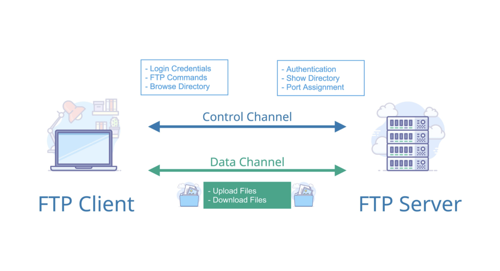
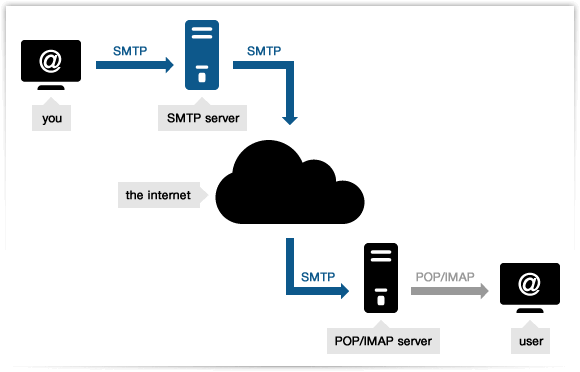

> 计算机网络知识

#1.网络模型分类

## 1.1 TCP/IP模型

- 应用层
> 位于网络传输栈协议里面的最高层，应用层即应用将数据封装好为了下一层做好准备（或者接受下一层的数据来进行解析），常用的协议有http（超文本传输协议）、
https、FTP(文件传输协议)、Telnet、DNS、SMTP等，应用层只负责将数据封装好，并不去关心怎么去传输。
- 传输层
> 位于应用层的下一层，是为了数据传输提供一系列的网络支持（所谓的网络支持即让待发送的应用数据能够通过网络进行传输，并且这里只负责应用到应用的通信，
别的方面更为复杂的端到端通信交给下一层处理），常用的协议有TCP、UDP。
- 网络层
> 所谓的网络层，即让数据能够在互联网上得到正确的转发，并被正确的接收，所以需要加入其它的额外信息，IP头是其中较重要的一个，网络层里面设计的协议也很多。
- 网络接口层
> 网络接口层主要为网络层提供「链路级别」传输的服务，负责在以太网、WiFi 这样的底层网络上发送原始数据包，工作在网卡这个层次，使用 MAC 地址来标识网络上的设备。
#2.典型网络协议

## 2.1 应用层
### 1.Http协议
> 超文本传输协议，所谓的超文本，即不同于一般的文本文件，该文件里面可以包含图片、文本、视频、音频等，HTTP 是一个在计算机世界里专门在「两点」之间「传输」文字
、图片、音频、视频等「超文本」数据的「约定和规范」。  
- 约定和规范1：超文本信息和连接状态
> 既然是协议，肯定少不了对超文本的约束，http协议里面就会对待传输的超文本信息进行约定，比如编解码的方式（Content-Encoding ）、数据的字节大小（Content-Length）、
数据的类型（Content-Type）、连接的状态（Connection）。
- 约定和规范2：状态码
> 状态码是用来表示在应用层面发送数据或者接受数据可能出现的一些状态，
### 2.Https协议
> 相比于http明文传输，https是一种加入了SSL/TLS的加密传输协议，因此需要向CA(证书权威机构)申请数字证书，保证服务器是可信。
- 混合加密
> 通信建立前采用非对称加密的方式交换公话密钥；通信过程中采用对称加密方式加密明文数据。
- 摘要算法+数字签名
> 摘要算法即对传送的内容进行哈希映射，得到哈希值（保证数据的完整性）；数字签名即采用私钥加密、公钥解密的方式保证传输数据内容的哈希值（非内容）不被篡改，因为
非对称的比较耗性能；（对内容是采用公钥加密、私钥解密的方式）
- 数字证书
> 为了验证加密的公钥是有效的，需要向数字证书机构去进行申请相应的证书，将公钥放到证书中，证书可信、公钥可信。
### 3.FTP协议
  
> 文件传输协议，基于可靠传输TCP设计的，在客户端和服务端建立两条TCP连接，一条用于传送控制信息，另一条用于传送数据信息，将控制和数据分开，提高了传输的效率。
### 4.Telnet协议
> 远程登录协议，通过一个终端进行远程的登录，是建立在可靠TCP协议上的，但是所传输的数据是用明文形式发送的，会存在潜在的风险。

### 5.SSH协议
> 安全的shell协议，其实就是在telne基础之上对数据进行一个加密，保证数据的安全性。
### 6.DNS协议
> 域名解析协议，是将域名解析成对应的IP地址而设计的协议，在资源定位符url的中间通常就是域名，比如https://www.baidu.cn中的www.baidu.cn就是域名。域名解析的
过程：浏览器即我们的应用程序会查看是否缓存了相关的域名IP，如果没有就会看操作系统下有没有缓存，如果没有再按照根到本地DNS服务器的顺序去逐个发送请求，直到找到为止。
### 7.SMTP协议

> 简单邮件传输协议，基于TCP协议来去发送电子邮件，在发送邮件的时候，会根据目的域名对邮件进行转发，最终转发到目的服务器上。

### 7.POP3/IMAP协议
> 邮件的接收协议，只负责邮件接收的工作。

## 2.2传输层

### 1.TCP协议
> TCP 是面向连接的、可靠的、基于字节流的传输层通信协议。TCP协议的内容比较多，因为TCP需要保证数据传输的可靠性，那么势必会增加很多控制的版块。
- 数据块分块
    >   应用数据被分割成 TCP 认为最适合发送的数据块，再传输给网络层，数据块被称为报文段或段。
- 对失序数据包重新排序以及去重
    >   数据在传输的时候免不了丢失的情况，通过序列号的方式能够保证数据全部发送并且可以去重。
- 校验和
    > 对首部和数据进行一个校验，防止数据在传输过程中出现了变化，起到一个校验的作用。
- 超时重传
    > 发送的数据如果在合理的往返时延（RTT)内未收到确认消息，那么对应的数据就会被认为已丢失并进行重传。
- 流量控制
    > 发送的数据最终是要接收端进行接收，而接收就必须硬件设备有相应的内存空间可以放下，不然发送的数据接收却不能放下也就导致了后面
无法对这些数据正常处理，而这个空间就是所谓的缓冲区大小，TCP里面是通过滑动窗口来控制的，当接收方来不及处理时会调整大小来提醒发送方
降低发送的速率。
- 拥塞控制
    > 和滑动窗口类似，拥塞控制也是用一个窗口去控制，称为拥塞窗口，目的是为了防止网络中的数据过多造成过载导致网络的性能变差，所以拥塞控制
是一个全局性的过程，不同于流量控制里面的是点对点通信量的控制。
    - 慢开始
        > 当发送方开始发送数据的时候，拥塞窗口从比较小的值开始增加，防止一开始数据过多造成网络堵塞。
    - 拥塞控制
        > 让拥塞窗口 cwnd 缓慢增大，即每经过一个往返时间 RTT 就把发送放的 cwnd 加 1。
    - 快重传和快恢复
        > 如果在传输数据的时候，部分数据丢失的话，会导致TCP使用定时器暂停传输，会导致整个的效率比较低，快重传、恢复的话就会使得
    接收端给发送端发生重复确认的信号，发送端接收到三次重传信号后就会立刻重传。
    - ARQ(自动重传请求)
        > 其实就是为了防止数据发送之后没有被正常接收而设计的机制，发送方发送完数据之后并不意味数据就能被正常接收，按照分组发送然后
    停止等待ack确认信息和在发送窗口内的连续发送可以分为停止等待和连续等待。
        1. 停止等待
            > 每一次发一个分组就等待确认信息，无差错的情况下，会在RTT(Retransmission Timeout，比数据在分组传输
的平均往返时间要长一点点)内接收到ACK即确认信号；发送数据有差错的情况下，会直接触发自动重传机制，重传数据分组；确认丢失的情况下，会
触发发送端继续重传，这时候接收端接收到重复数据，丢弃并发送确认信息ack（因为发送端重传说明ack信息丢失了）；确认迟到的情况下，会导致
发送端发送两次，导致B也发送两次确认收到，只不过接收端和发送端都会对重复的丢弃。
        2. 连续等待
            > 不是按照组一组一组的确认，而是在一个发送窗口内，对窗口内按序到达的最后一组发送确认，这样做好处就是信道的利用率高，
容易实现，即使确认丢失也不必重传，缺点就是不能反映出接收方接收到的正确分组信息。

> HTTP、HTTPs、FTP等是基于TCP设计的。
- 关于三次连接的经典问题
  1. 为什么三次不是两次、四次？
     > 1.防止旧的重复连接初始化造成了混乱（旧的连接先到达，应该舍弃掉，不然会造成混乱，两次做不到）。
     > 2.同步双方的序列信号（四次握手也可以做到，但是可以将发送syn和ack两次合并到一起即三次）。
     > 3.避免资源的浪费（客户端重复发送syn信号，两次连接导致服务端重复建立连接造成资源浪费）。
- 关于四次挥手的经典问题
  1. 过程的描述
     > 客户端发送FIN，进入到FIN_WAIT_1，服务端接收到发送ACK,进入到CLOSE_WAIT,客户端接收到ACK,进入到FIN_WAIT_2,即
等待服务端将剩余的数据发送完毕，服务端发送完剩下的数据之后，也随机发送FIN,进入到LAST_ACK，客户端接收到FIN之后，进入到TIME_WAIT
，即经过2MSL一段时间后再进入CLOSE,服务端收到最后一个ACK，直接CLOSE。
  2. 为什么主动关闭方最后需要那个TIME_WAIT，直接关闭不行吗？
     > 1.防止历史连接中的数据，在连接关闭之后，由于延迟，导致被后面相同四元组的连接错误接收。
     > 2.保证被动关闭的一方能够正确的关闭（因为存在主动方最后的ack到不了，导致被动方继续重发FIN，如果不等待此时关闭引发RST即终止的信息）。
### 2.UDP协议
> 相比于TCP，UDP是面向无连接的一种方式，因为不是一对一的连接，所以UDP里面就不包含源和目标地址，只有源和目标的端口号，还有包长度，
校验和。

> DNS、SNMP等（包总量较少的通信场景）；视频音频等多媒体通信（需要高效）；广播通信。
### .IP协议

