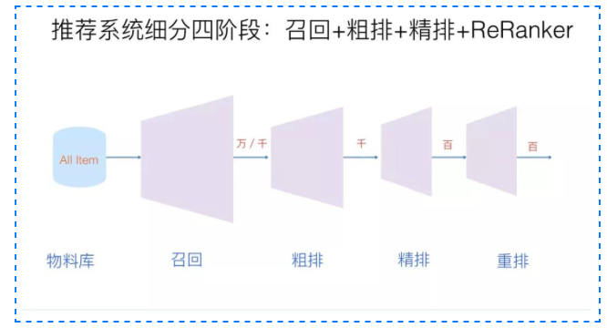

# 推荐系统方面的知识总结


## 主要内容

- [基本的概念](#Concept)
- [召回模型](#Recall)
- [排序模型](#Rank)

## <a id = 'Concept'></a>1.基本概念
### 1.1推荐和搜索
>推荐不同于搜索，搜索是用户指定一个特定的搜索词然后根据搜索词去寻找匹配
> 的结果，范围很小，目的更明确，而推荐则是根据用户交互的历史来去给用户
> 推荐那些用户最为感兴趣的部分，目的没那么明确，难度更大。  
> **搜索里面的马太效应：**对于搜索来说，用户倾向于点击那些排在前面的搜
> 索结果，而对于排在后面的很少关注，这就是马太效应。  
> **推荐里面的马太效应、长尾效应：**对于推荐来说，用户倾向于关注那些热门物品，
> 即冷门产品不怎么被关注；同时推荐里面的冷门产品的数量远关于热门产品的数量，
> 即长尾效应。
### 1.2架构的模块分层
1. 离线层
    > 只使用离线的数据，即不会更新数据，对实时性无要求。
2. 近线层
    > 会使用实时的数据，但是不保证实时性。
3. 在线层
    > 使用实时数据，需要保证模型能够对实时的数据做出高效的处理，实现在线服务。
### 1.3主要流程

1. 物料库
   >  物料库即物品资料的仓库，信息存储的地方，包括用户和产品的相关
   信息，通过物料库里面的内容我们来对用户和产品进行建模，即所谓的用户
   画像和产品画像的构建，所有物料库的构建对于推荐系统后序的建模分析
   > 至关重要。
   > - 内容理解：  
   >> 物料库里面的内容形式多变，有文本、图像、语音、视频等，对于获取
   > 到的数据，我们需要对这些内容进行深一步的分析，即提取出对于反映
   > 用户或者产品特性的关键信息，比如图像可以进行人脸识别、OCR识别以及
   > 质量评价等，文本可以根据不同内容进行划分，比如主题、关键词、高频词和
   > 用户评论等。
   > - 知识图谱（Knowledge Graph）：
   >> 为了更好的刻画用户和用户之间、用户与产品之间以及产品与产品之间的联系，
   > 利用知识图谱将用户和产品的信息融入进去，使得最后的用户和产品信息表示更
   > 加全面，有利于提高推荐系统的准确性，同时使得模型具有可解释性。  
   > [关于知识图谱](https://zhuanlan.zhihu.com/p/160799232)  
   > [关于知识图谱](https://cloud.tencent.com/developer/article/1950487)
2. 召回
   > 召回的目的是根据用户的历史数据来从海量的信息中筛选出一部分推荐给用户，
   > 由于召回所面对的数据量很庞大，所以用户和产品之间必须解耦，即不要求去计算
   > 交叉统计特征【对于用户特征和产品特征之间的关联性进行分析得到的特征】，否则
   > 会导致召回的效率极其低下，无法满足线上实时性的要求。
3. 排序
   > 排序的目的即是根据召回的结果对产品进行更深一步的分析，即使得最后推荐的结果
   > 能够尽可能的精确，由于此时所用的数据相比于召回时要少很多，一般在排序层面我们
   > 会对用户和产品的特征做交叉统计，即分析用户和产品之间的更深层次的联系，重在精准。
   - 粗排
      > 对于召回之后数据仍然很多的情况做一个粗排。
   - 精排
      > 获取粗排模块的结果，对候选集进行打分和排序。精排需要在最大时延允许的情况下，
      保证打分的精准性，是整个系统中至关重要的一个模块，也是最复杂，研究最多的一
      个模块。精排系统构建一般需要涉及样本、特征、模型三部分。
   - 重排
      > 获取精排的排序结果，基于运营策略、多样性、context上下文等，重新进行一个微调。
      比如三八节对美妆类目商品提权，类目打散、同图打散、同卖家打散等保证用户体验措施。
## <a id = 'Recall'></a>2.召回模型
### 2.1基于协同过滤的召回
> 什么叫协同过滤？其实这里的协同即用户和产品之间的协同交互，比如用户访问过了什么样的产品，
> 产品被多少个用户访问过，这些都是后面用来计算相似度的依据，本质上就是利用它们之间的交互
> 信息来去表示用户和产品，最后来计算相似度。
- 基于用户
  > 什么叫基于用户呢？其实就是从以用户作为推荐的第一优先级，给待推荐用户推荐和它相似度
  > 最高的那些用户访问过的产品（这里可以理解为有着相似爱好的用户喜好的产品应该大差不差）
  > [具体源码](#u2uCF)。
- 基于产品
  > 什么叫基于产品？其实就是以产品作为推荐的第一优先级，给待推荐用户推荐那些和本身访问
  > 过的最相似的其它产品。[具体源码]()
- 基于模型
  > 其实说到模型就比较宽泛了，凡是用机器学习来去建模解决这个问题的其实都可以理解成一个
  > 基于模型的方法，通过建立适当的模型来去更好的计算用户之间、产品之间的相似度，从而最终
  > 给用户推荐分数最高的产品。[基于模型](https://cloud.tencent.com/developer/article/1184600)
  - >>矩阵分解的方式：典型的就是基于隐向量的FM方法，即在协同过滤共现矩阵的基础上
  使用更稠密的隐向量表示用户和物品，还有许多变种FunkSVD，BiasSVD和SVD++。
  - >>[关联算法](https://blog.csdn.net/qq_36523839/article/details/82191677):
    寻找数据之间的关联，通过频繁集项（经常出现在一起的物品）和关联规则（物品之间可能出现
    很强的关系），典型的如[Apriori算法、](https://www.cnblogs.com/pinard/p/6293298.html)
    [FP Tree、](https://www.cnblogs.com/pinard/p/6307064.html)
    [PrefixSpan](https://www.cnblogs.com/pinard/p/6323182.html)
  - >> 聚类算法：
    将用户或者产品进行聚类分析，得到各个用户群或者产品群，对于待推荐用户，直接根据同一个用户群里面
    评分高的产品来去做推荐或者推荐同一个产品群里面的其它产品。典型的比如
    [k-means](https://www.cnblogs.com/pinard/p/6164214.html)
    [BIRCH](https://www.cnblogs.com/pinard/p/6179132.html)
    [DBSCAN](https://www.cnblogs.com/pinard/p/6208966.html)
  - >> 分类算法：
    典型的分类算法就有逻辑回归和贝叶斯算法。
    >> 回归算法：
    典型的回归有岭回归、回归树、支持向量回归。
## <a id = 'Rank'></a>3.排序模型

### 源码部分
- <a id = 'u2uCF'></a>基于用户的CF
```python3
# 基于用户的召回 u2u2i
def user_based_recommend(user_id, user_item_time_dict, u2u_sim, sim_user_topk, recall_item_num, 
                         item_topk_click, item_created_time_dict, emb_i2i_sim):
    """
        基于文章协同过滤的召回
        :param user_id: 用户id
        :param user_item_time_dict: 字典, 根据点击时间获取用户的点击文章序列   {user1: [(item1, time1), (item2, time2)..]...}
        :param u2u_sim: 字典，文章相似性矩阵
        :param sim_user_topk: 整数， 选择与当前用户最相似的前k个用户
        :param recall_item_num: 整数， 最后的召回文章数量
        :param item_topk_click: 列表，点击次数最多的文章列表，用户召回补全
        :param item_created_time_dict: 文章创建时间列表
        :param emb_i2i_sim: 字典基于内容embedding算的文章相似矩阵
        
        return: 召回的文章列表 [(item1, score1), (item2, score2)...]
    """
    # 历史交互
    user_item_time_list = user_item_time_dict[user_id]    #  [(item1, time1), (item2, time2)..]
    user_hist_items = set([i for i, t in user_item_time_list])   # 存在一个用户与某篇文章的多次交互， 这里得去重
    
    items_rank = {}
    #取出前k个和用户最相似的用户
    for sim_u, wuv in sorted(u2u_sim[user_id].items(), key=lambda x: x[1], reverse=True)[:sim_user_topk]:
        #对于这些相似用户访问过的产品计算这些产品和待预测用户已经访问过的产品相似度
        #即相似用户【相似爱好】的相似产品【相似用途、特性等】推荐给用户
        for i, click_time in user_item_time_dict[sim_u]:
            if i in user_hist_items:
                continue
            items_rank.setdefault(i, 0)
            
            loc_weight = 1.0
            content_weight = 1.0
            created_time_weight = 1.0
            
            # 当前文章与该用户看的历史文章进行一个权重交互
            for loc, (j, click_time) in enumerate(user_item_time_list):
                # 点击时的相对位置权重
                loc_weight += 0.9 ** (len(user_item_time_list) - loc)
                # 内容相似性权重
                if emb_i2i_sim.get(i, {}).get(j, None) is not None:
                    content_weight += emb_i2i_sim[i][j]
                if emb_i2i_sim.get(j, {}).get(i, None) is not None:
                    content_weight += emb_i2i_sim[j][i]
                
                # 创建时间差权重
                created_time_weight += np.exp(0.8 * np.abs(item_created_time_dict[i] - item_created_time_dict[j]))
                
            items_rank[i] += loc_weight * content_weight * created_time_weight * wuv
        
    # 热度补全，如果不足以k个，则取热门产品进行补全
    if len(items_rank) < recall_item_num:
        for i, item in enumerate(item_topk_click):
            if item in items_rank.items(): # 填充的item应该不在原来的列表中
                continue
            items_rank[item] = - i - 100 # 随便给个复数就行
            if len(items_rank) == recall_item_num:
                break
        
    items_rank = sorted(items_rank.items(), key=lambda x: x[1], reverse=True)[:recall_item_num]    
    
    return items_rank
```

